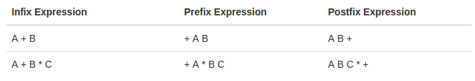

<table class="hide" width="100%" style='table-layout:fixed;'>
  <tr>
   <td>
    <a href="https://airtable.com/shr5KEX8NFdrG14j9?prefill_clase=01-JavaScriptAvanzado-I">
   
   <br>
   Hacé click acá para dejar tu feedback sobre esta clase.
    </a>
   </td>
      <td>
     <a href="https://quiz.soyhenry.com/evaluation/new/6057d0a5656c8d23c2e60e3e">
      
      <br>
      Hacé click acá completar el quizz teórico de esta lecture.
     </a>
 </td>
  </tr>
</table>

# JavaScript

#### Avanzado I

Empecemos con algunos fundamentos:

## Single Threaded y Sincrónico

En ciencias de la computación un thread (o hilo de ejecución) es la secuencia de instrucciones más pequeña que puede ser manejada por un _planificar de recursos_ (él que se encarga de repartir el tiempo disponible de los recursos del sistema entre todos los procesos) del Sistema Operativo.


JavaScript es __Single Threaded__ y sincrónico, es decir que sólo puede hacer un sólo comando o instruccion en cada momento y que lo hace en orden, empieza la instrucción siguiente cuando termina la anterior. Esto puede sonar confuso, porque vemos que, en el browser por ejemplo suceden muchas cosas al _mismo tiempo_ o bien, cuando tiramos una función asincrónica y esta se realiza mientras nosotros hacemos otras cosas, etc... esto sucede porque en general usamos javascript en conjunto con otros __procesos__, que pueden ser o no single threaded y en conjunto nos da la sensación que está ocurriendo todo al mismo tiempo, aunque es muy probable que no sea así.

> Los procesadores son tan rápidos que nos dan la sensación de paralelismo en tareas cuando en realidad se hacen en serie.

## Syntax Parser

Un programa que lee tu código y determina qué hace y si su sintaxis es válida. Si todo está bien se generá código legible por la computadora que luego es ejecutado como instrucciones. Lo importante de esto, es que el intérprete  además puede agregar ciertos comportamientos extras, vamos a ver algunas de esas cosas extras que el intérprete maneja por nosotros.

## Lexical Environment

El lexical environment tiene que ver con _dónde_ están declarados ciertos statements o expresiones en tu código. Es decir, el comportamiento de JavaScript puede cambiar según dónde hayas escrito el código.

```js
function hola() {
  var foo = 'Hola!';
}

var bar = 'Chao';
```

Por ejemplo, para el intérprete las dos declaraciones de variable del arriba tendrán significados muy distintos. Si bien la operación es igual en los dos (asignación) al estar en lugares distintos (una dentro de una función y la otra no) el intérprete las parseará de forma distinta.

> En otros lenguajes puede que el lexical environment no cambie el comportamiento de la ejecución del código.

## Execution Context

El contexto de ejecución contiene información sobre _qué_ código se está ejecutando en cada momento. Además de mantener el código que tiene que ejecutar, también mantiene más información sobre desde dónde se invocó ese código, en qué lexical enviroment está, etc...

### Global Enviroment

Cada vez que ejecutamos algo en JavaScript __se corre dentro de un contexto de ejecución__. Como todo el código corre en un contexto, si no especificamos ese contexto (veremos cómo se hace despues) entonces el código se va a ejecutar en el __contexto global__, que es el contexto de base que nos crea automáticamente el interprete.

> Básicamente, vamos a decir que es __global__ cualquier bloque de código que no esté declarado dentro de una función.

Además de ejecutar el código que le pasemos, también crea un __objeto global__ y además crea una variable llamada __this__. Por ejemplo, si usamos el engine de javaScript de Chrome ( este es el intérprete ), y vamos a la consola vamos a ver que el _objeto global_ que mencionamos el es objeto `window` y que la variable `this` hace referencia a ese objeto. Esos objetos los generó el interprete cuando creó el ambiente de ejecución. Si abro otra pestaña voy a tener otro objeto `window` similar, ya que es otro contexto de ejecución.


> Si corremos JavaScript en otro ambiente que no sea el browser, por ejemplo con NodeJs o con otros engines, es muy probable que el objeto global no sea `window` y sea otro. Pero siempre hay UN objeto global.

En JavaScript, cuando declaramos variables y funciones en el contexto global, estos se guardan en el objeto global. Si declaramos variables y funciones en la consola de desarrollador, vamos a ver que estás aparecerán dentro de `window` que es el objeto global.


Por último, el contexto de ejecución tambien mantiene una referencia a otros contextos de ejecución (desde donde fue creado). Como ahora hablamos del contexto global, esta referencia contiene el valor `null`, ya que no hay otro contexto que haya invocado a este.


### Creando el contexto de ejecución / Hoisting

Veamos como el intérprete crea el contexto de ejecución global. Cuando el interprete lee un bloque de código realiza un proceso llamado `hoisting`. Básicamente lee todo el código buscando declaraciones de variables y funciones, y reserva un espacio en memoria para ellas.

Probá ejecutar lo siguiente en JavaScript:

```javascript
bar();
console.log(foo);

var foo = 'Hola, me declaro';
function bar() {
 console.log('Soy una función');
}
```

En otros lenguajes, si intentaramos invocar una función o una variable que está definida _'más abajo'_ seguramente tendríamos un error. Pero JavaScript, al realizar el proceso de `hoisting`, ya tiene reservado el espacio para esas variable y funciones, por lo tanto no se genera un error. Notesé que a la función la pudo ejecutar, esto quiere decir que durante el hoisting guardó su contenido también, no sólo reservó el espacio. Pero con el caso de la variable, sólo reservo el espacio, ya que cuando hacemos el `console.log` vemos que contiene `undefined`.

> Podemos pensar el Hoisting como que el interprete '_mueve_' las declaraciones a la parte de már arriba de nuestro código. Sólo lo hace con las declaraciones y no con las inicializaciones.

Para entender por qué el interprete hace esto, tenemos que saber cómo se crea el contexto de ejecución. Esto se hace en dos fases. La primera es la fase de creación (creation phase). En esta fase el interprete genera el _objeto global_, asigna la variable _this_ y las referencias a otro contexto de ejecución (Outer Context), y además reserva el espacio para todas las variables y funciones que vaya a utilizar ese contexto, justamente en este último paso es donde se genera el proceso de `hoisting`.


> El hosting es el primer ejemplo de las _cosas extras_ que hace el interprete sin que nosotros se lo pidamos. Si no las conocemos, nos puede pasar que veamos comportamientos extraños y no sepamos de donde vienen (como que podamos usar funciones que no hemos declarado antes de invocarlas!!)

La segunda fase es la _fase de ejecucción_, en esta fase, ya tenemos todo lo que se creo en la primera fase, y ahora sí el intérprete __ejecuta__ nuestro código, línea por línea!.

Este proceso de crear contextos de ejecución sucede siempre al principio cuando se crea el contexto global, ahora vamos a ver que también sucede cada vez que invocamos una función en nuestro código, como se pueden imaginar, en un script cualquiera, es muy probable que se creen varios contextos de ejecución (muchas invocaciones a funciones), estos contextos se van a ir _apilando_ en la __pila de ejecución o execution stack__.

## Execution stack

Para ilustar cómo se van creando y cómo se apilan los contextos veamos el siguiente código:

```javascript
function b() {
  console.log('B!')
};

function a() {
  // invoca a la función b
  b();
};

//invocamos a
a();
```

Veamos que ocurre cuando corremos este script: Como sabemos, lo primero que pasa es la creción del contexto global y el proceso de _hoisting_, entonces la función `a` y `b` van a estar en memoria. Una vez que termina eso, empieza la fase de ejecución, en esa fase es que el interprete va a recorrer línea por línea el script. En nuestro ejemplo hay una única línea para ejecutar (las otras las leyó durante el _hoisting_) que es la línea donde invocamos a `a()`.

Lo que sucede ahora, es que se crea un _nuevo contexto de ejecución_ que se va a poner arriba del contexto de ejecución global (creando la pila). Básicamente, el contexto que esté arriba de la pila, es el que se está ejecutando en ese momento ( o cuando le den tiempo de procesador a JavaScript). Cuando se creó ese contexto nuevo, pasó lo mismo que cuando creamos el global, el intérprete generó la variable `this` y pusó las referencias al `outer context` (en este caso el outer context es el contexto global), después de hacer todo eso, el intérprete va a ejecutar línea por línea el código del nuevo contexto, es decir, _el código de la función `a`. Ahora, dentro de `a` hay una sóla línea de código, y en esa línea se invoca a `b`. Si! como se imaginan, el intérprete va a crear un_nuevo_ contexto de ejecución para la función `b` (haciendo de nuevo los pasos previamente mencionados), y poniendolo en la cima de la pila.


> Cada invocación a una función crea un contexto de ejecución nuevo, que pasa por las dos fases de creación antes mencionadas. Cuando se termina de ejecutar, se _destruye_ y se saca de la pila de ejecución para seguir con los que quedan.

### Scope

Ahora que sabemos que existen los contextos de ejecución, podemos entender más fácilmente que ocurre con las variables que creamos dentro de las funciones que invocamos. Cada contexto maneja sus propias variables, y son independientes de los demás. Justamente por eso, podemos usar los mismos nombres de variables dentro de funciones que creamos sin que _pisen_ las demás.
También sabemos que podemos acceder a una variable declarada en el contexto global dentro de una función. Esto se debe a que JavaScript primero busca una variable dentro del contexto que se está ejecutando, si no la encuentra ahí, usa la referencia al `outer context` para buscarla dentro de ese contexto. Gracias a esto vamos a poder acceder a variables que estén afuera de nuestro contexto (siempre y cuando no hayamos declarado una nueva con el mismo nombre!!).

Veamos en el código siguiente el comportamiento de las variables:

```javascript
var global = 'Hola!';

function a() {
  // como no hay una variable llamada global en este contexto,
  // busca en el outer que es el global
  console.log(global); 
  global = 'Hello!'; // cambia la variable del contexto global
}

function b(){
  // declaramos una variable global en nuestro contexto
  // esta es independiente 
  var global = 'Chao'; 
  console.log(global);
}

a(); // 'Hola!'
b(); // 'Chao'
console.log(global); // 'Hello'
```

Para esto vamos a introducir el término `scope`, este es **el set de variable, objeto y funciones al que tenemos acceso en determinado contexto**. En el ejemplo anterior, la variable `global` está definida en dos `scopes` distintos, uno es el `scope global` y el otro es el `scope` de la función `b`, esto quiere decir que, a pesar de tener el mismo nombre, estas dos variables son distintas.

Justamente, cuando JavaScript no encuentra una variable en su scope, lo que hace es buscar en otros scopes (de contextos que esten en la referencia de `outer contexts`). A esta búsqueda en distintos scope se la conoce como __the scope chain__, ya que el intérprete busca en cadena scope por scope por el nombre de la variable, hasta llegar al scope global. Noten que el `outer enviroment` no es necesariamente el contexto que esté debajo en la pila de ejecucción, ni tampoco el contexto en donde se invocó la función, si no __es el contexto en donde se definió la función!__ (Se acuerdan que dijimos que en javascript el _lexical enviroment_ era importante?).

> Si el intérprete llega el scope Global sin encontrar la variable, entonces va a tirar un error.

Prueben el siguiente código y miren comó cambió todo cuando declaramos la funcion `a` __dentro__ de la función `b`:

```javascript
var global = 'Hola!';

function b(){
 var global = 'Chao'; 
 console.log(global); // Chao
 function a() {
  // como no hay una variable llamada global en este contexto,
  // busca en el outer que es scope de b;
  console.log(global); //Chao 
  global = 'Hello!'; // cambia la variable del contexto de b()
 }  
 a();
}

//a(); Ya no puedo llamar a a desde el scope global, acá no existe.
b();
console.log(global); // 'Hola!'
```

## Asynchronous non blocking

Ahora que sabemos un poco más sobre cómo hace JavaScript para ejecutar el código, veamos que pasa cuando usamos una función asincrónica a la que le pasamos un callback.

> __Callback__: Le llamamos así a una función que le pasamos como argumento a otra función, para que sea invocada en esta ultima, en general cuando se cumpla una condición o termine de realizar algo (leer un archivo, escribir en una base de datos, traer datos de internet, etc...) .

Cuando decimos código _Asincrónico_ quiere que su ejecución o su completitud está diferida en el tiempo. Por ejemplo, cuando declaramos un evento, el código o la función callback se va a ejecutar cuando suceda ese evento y no cuando el intérprete lee esas líneas, o cuando hacemos un request tipo _AJAX_ y esperamos que llegue la respuesta, etc... En todos estos casos, el engine JavaScript sigue haciendo o ejecutando otras líneas de código, y esto nos puede dar la _sensación_ que estamos haciendo más de una cosa a la vez. Pero al principio dijimos que javascript es sincrónico y que ejecuta _una sóla cosa a la vez_, veamos cómo logra darnos esa [_sensación_](https://www.youtube.com/watch?v=nJXVIjxRq_A).

Para entender esto, tenemos que ver un poco la imagen grande. Cuando hablamos del engine Javascript tenemos que comprender que nunca actuá sólo, siempre va a estar acompañado por otros componentes de software. El Engine de JavaScript tiene formas de comunicarse con estos otros componentes. Por ejemplo, el componente encargado de _renderizar_ las páginas, o el componente encargado de hacer _http requests_ (en general estos están programados en C o C++). Lo que sucede entonces, es que JavaScript le __pide__ cosas a los demás componentes y les pide que le __avise__ cuando terminen de hacer esas cosas. Por lo tanto, los demás componentes del browser se encargán de hacer ese trabajo y cuando sucede un evento o terminan una tarea le _avisan_ al engine, este interrumpe su proceso normal y mete el callback en el execution stack para realizarla.

Para lograr este comportamiento, el engine JavaScript tiene lo que se conoce como __Event Queue__, que es una cola que inicialmente está vacía y es en donde el browser (o quien se encarge de realizar las tareas) va a ir poniendo los avisos notificando que se terminó de ejecutar tal tarea. Ahora el engine JavaScript intercala cosas que tienen que ejecutar de su _execution stack_ con cosas que tiene que hacer del __event queue__, de esta forma nos da la sensación que hay cosas que se hacen en paralelo. Cuando en realidad estamos delegando las tareas a otros componentes.

> Para entender exactamente como trabaja el _Event queue_ en conjunto con los demás componentes miren [este video](https://www.youtube.com/watch?v=8aGhZQkoFbQ), en donde está perfectamente explicado.

## Operadores y Tipos de Datos en JavaScript

Antes de avanzar repasemos algunos conceptos de programación.

## Tipos de Datos

### Static Typing vs Dynamic Typing

Todos los lenguajes de programación tienen características distintas que los caracterizan. Una de ellas es la forma con la que trabajan con variables y tipos de datos. JavaScript en particular tiene lo que se conoce como `tipado dinámico` o `dynamic typing`. Esto quiere decir que no tenemos que decirle al intérprete que tipo de datos contiene una variable, él lo calcula por si mismo. En otros lenguajes, al declarar una variable tenemos que avisarle qué tipos de datos vamos a guardar en ella (`static typing` o `tipado estático`). Otra cosa importante, es que JavaScript nos permite __cambiar__ el tipo de datos que guardamos en una variable, por ejemplo, podemos tener una variable con un número y luego guardar una string en la misma variable, en otros lenguajes hacer esto nos resultaría en un error.

> Cuando queremos convertir algo de un tipo de datos a otro, usamos el termino _castear_.

### Tipos de datos Primitivos en JavaScript

Un tipo de datos Primitivo, son tipos de datos básicos que vienen previamente definidos con el lenguaje. Usando estos tipos de datos primitivos vamos a poder crear tipos de datos más complejos.
En Javascript hay seis tipos de datos primitivos:

* __undefined__: Este representa que algo no está definido, como por ejemplo cuando declaramos una variable y no le asignamos nada, toma el valor `undefined` por defecto.
* __null__: Este tambien representa que algo no existe. Lo vamos a usar para decir que una variable está vacía o no tiene nada adentro. (No es lo mismo decir que una variable no está definida, a que NO tiene nada adentro. En el segundo caso _sabemos_ que no tiene nada.)
* __Boolean__: true o false.
* __Number__: Este tipo de datos representa un número real. En JavaScript todos los números son representados como tipo flotantes.
* __String__ : Una secuencia de caractéres.
* __Symbol__: Este tipo de datos es nuevo, está en el nuevo standart ES6. Por ahora lo ignoraremos.

## Operadores

Un operador no es otra cosa que una función, pero al ser funciones básicas para el Engine y que se utilizan muchos, se escriben de una forma particular y que en general es corta y simple. Generalmente, los operadores toman dos parámetros y retornan un resultado.
Por ejemplo: Para el intérprete al ver el signo `+`, sabe que tiene que ejecutar la función suma (que tiene internamente definida), y toma como parámetros los términos que estén a la izquierda y la derecha del operador. De hecho, es equivalente a tener una función que se llame `suma` y que reciba dos parámetros:

```javascript
var a = 2 + 3; // 5

function suma(a,b){
 return a + b; 
 // usamos el mismo operador como ejemplo
 // Si no deberiamos hacer sumas binarias!
}
var a = suma(2,3) // 5
```

De hecho, esa forma de escribir tiene un nombre particular, se llama notación notación `infix` o `infija`, en ella se escribe el operador entre los operandos. Pero también existen otro tipos de notación como la `postfix` o `postfija` y la `prefix` o `prefija`. En estas última el operador va a la derecha de los operandos o a la izquierda respectivamente.



En fin, lo importante a tener en cuenta es que los operadores _son_ funciones.

## Precedencia de Operadores y Asociatividad

Esto parece aburrido, pero nos va a ayudar a saber cómo piensa el intérprete y bajo que reglas actua.

La _precedencia de operadores_ es básicamente el orden en que se van a llamar las funciones de los operadores. Estás funciones son llamadas en _orden de precedencia_ (las que tienen __mayor__ precedencia se ejecutan primero).  O sea que si tenemos más de un operador, el intérprete va a llamar al operador de mayor precendencia primero y después va a seguir con los demás.

La _Asociatividad de operadores_ es el orden en el que se ejecutan los operadores cuando tienen la misma precedencia, es decir, de izquierda a derecha o de derecha a izquierda.

> Podemos ver la documentación completa sobre Precedencia y Asociatividad de los operadores de JavaScript [acá](https://developer.mozilla.org/en/docs/Web/JavaScript/Reference/Operators/Operator_Precedence#Table)

Por ejemplo: `console.log( 3 + 4 * 5)` Para resolver esa expresión y saber qué resultado nos va a mostrar el intérprete deberíamos conocer en qué orden ejecuta las operaciones. Al ver la tabla del link de arriba, vemos que la multiplicación tiene una precedencia de 14, y la suma de 13. Por lo tanto el intérprete primero va a ejecutar la multiplicación y luego la suma con el resultado de lo anterior -> `console.log( 3 + 20 )` -> `console.log(23)`.

> Cuando invocamos una función en Javascript, los argumentos son evaluados primeros (se conoce como [__non-lazy__ evaluation]()), está definido en la [especificación](http://es5.github.io/#x11.2.3).
> No confundir el orden de ejecución con asociatividad y precedencia, [ver esta pregunta de StackOverflow](http://stackoverflow.com/questions/13849906/operator-precedence-and-associativity-with-math-floormath-random).

Ahora si tuvieramos la misma precedencia entraría en juego la asociatividad, veamos un ejemplo:

```javascript
var a = 1, b = 2, c = 3;

a = b = c;

console.log(a, b, c);
```

Qué veriamos en el console.log? Para eso tenemos que revisar la tabla por la asociatividad del operador de asignación `=`. Este tiene una precedencia de 3 y una asociatividad de `right-to-left`, es decir que las operaciones se realizan primero de derecha a izquierda. En este caso, primero se realiza `b = c` y luego `a = b` (en realidad al resultado de `b = c`, que retorna el valor que se está asignando). Por lo tanto al final de todo, todas las variable van a tener el valor `3`. Si la asociatividad hubiese al revés, todos las variables tendrían el valor `1`.

## Coerción de Datos

Ahora, como JavaScript tiene `dynamic typing`, a veces el intérprete sólo cambia el tipo de datos de un valor a otro. Esto es conocido como __Coercion__. Por ejemplo, si hacemos `var a = 1 + 'hola'`, el resultado va a ser `1hola`. Lo que ocurrió es que el número `1` fue convertido a un string, y luego se realizó la operación de concatenado entre el `1` y el string `hola`. Lo importante es que nosotros nunca le pedimos a javascript que nos haga la conversión, el decidió hacerlo sólo (en otros lenguajes nos devolvería un error si quisieramos hacer lo mismo!).

> Cuando usamos el operador `===` le estamos diciendo al intérprete que __NO__ convierta los operadores antes de hacer la comparación.

A veces es obvio lo que JavaScript va a hacer cuando convierte una valor a otro, como por ejemplo, cuando convierte un número a un string. Pero a veces no es intuitivo. Con la función `Number()` podemos convertir valores a números, veamos algunos ejemplos:

```javascript

Number('3') // devuelve el número 3. Obvio!
Number(false) // devuelve el número 0. mini Obvio.
Number(true)  // devuelve el número 1. menos mini Obvio.
Number(undefined) // devuelve `NaN`. No era obvio, pero tiene sentido.
Number(null) // devuelve el nuḿero 0. WTFFFF!!! porqueeEE no debería ser `NaN`??
```

Tampoco es obvio cuando dejamos que el intérprete haga conversiones cuando comparamos por igualdad, de hecho hay una [tabla](https://developer.mozilla.org/en-US/docs/Web/JavaScript/Equality_comparisons_and_sameness#A_model_for_understanding_equality_comparisons) donde podemos ver qué cosas son iguales y cuáles no cuando usamos coercion.

> Podríamos decir que el valor `NaN` es un tipo primitivo de JavaScript. Este aparece cuando Js intenta convertir algo a un número, pero no puede hacerlo. Literalmente significa `Not a Number`.

Ahora sabiendo todo esto, qué cosa sucede en esta expresión `console.log(3 < 2 < 1)`. Por qué el resultado es `true`? Viendo las asociatividades y la coerción que está sucediendo deberíamos poder explicarlo.

> Prueben ver a qué convierten las cosas, para booleanos podemos usar Boolean(), para strings String().

## Funciones y Objetos

### First Class Functions

Algo muy importante de JavaScript es que las funciones son de tipo `first class`, esto quiere decir que las funciones pueden ser tratadas igual que cualquier otro tipo de valor. Es decir, que podemos pasar una funcion como argumento, podemos asignar una función a una variable, podemos guardarla en un arreglo, etc..
Esta es una de las features de JavaScript que lo hace muy poderoso, hay otros lenguajes que pueden hacer lo mismo, pero el más popular es JavaScript.
De hecho, las funciones en JavaScript son un tipo especial de objetos. Este objeto, además de poder tener cualquier propiedades adentro (como cualquier objeto) tiene dos propiedades especiales: La primera es el nombre (`name`), que contiene el nombre de la función, esta propiedad es opcional ( funciones anónimas ). La segunda propiedad se llama `code` (código) y en ella se guarda el código que escribiste para la función.


En el código de abajo, declaramos una función y luego le agregamos una propiedad llamada `saludo` a ella. Como la función es un objeto, entonces podemos hacer esto sin problemas.

```javascript

function hola(){
 console.log('hola');
}

hola.saludo = 'Buen Día';
console.log(hola);
```

También vemos que al hacer el console.log de la función, el intérprete nos devuelve el código que tiene adentro la función en una string. Esto es justamente la propiedad `code` que tienen todas las funciones.

### Expresión

Una Expresión es una unidad de código que evaluá a un valor. Por ejemplo, `a = 3`, es una expresión que devuelve el número `3`. `1 + 2` también es una expresión que retorna `3`. Las expresiones pueden ser escritas en cualquier lugar donde se espera un valor, por ejemplo: `console.log( 1 + 2);`.

### Statement

Los Statements, no producen un valor directamente, si no que _hacen algo_, generalmente tienen adentro expresiones. Según el statement que usemos vamos a tener un comportamiento distinto, ejemplos de statements son `if`, `while`, `for`, etc...

En javascript, en términos de funciones podemos tener ambos `functions statements` y `functions expressions`, veamos la diferencia de ambos.

```javascript
function saludo(){
 console.log('hola');
}
```

El de arriba es un `function statement`, cuando esto es ejecutado por el intérprete no retorna nada, pero sí hace algo: reserva un espacio en memoria para la función que definimos.

```javascript
var saludo = function(){
 console.log('Hola!');
}

console.log(function(){
 //hola;
})
```

En este segundo caso, estamos usando una `function expression`, en la cual estamos creando un objeto de tipo función (anónima) y además la estamos guardando en una variable llamada `saludo`. Justamente, la variable saludo va a apuntar a una dirección de memoria que contiene el objeto de tipo función que creamos anónimamente en una expresión (esa expresión retornó el objeto que se _guardó_ en la variable.). Cuando declaramos una función anónima y la pasamos como argumento, también estamos haciendo una `function expression`.

### Pasando variables por referencia o por valor

Hay dos formas de pasar variables en cualquier lenguaje de programación, en algunos podemos elegir la forma nosotros pero en JavaScript el intérprete elige la forma él mismo.

Las dos formas son, por valor o por referencia. Veamos la siguiente animación:


Cuando pasamos algo por referencia, estamos pasando una _referencia_ o un puntero al objeto. Por lo tanto, cualquier cambio que hagamos a esa referencia, se va a ver reflejado en el objeto original. En el ejemplo, pasamos una referencia a la taza y en nuestra función la llenamos de café. Al ser una referencia al objeto `cup`, vemos que se ve reflejado el cambio en ella (se llena de café) ya que son el __mismo__ objeto!.

En cambio, cuando pasamos algo por valor, estamos pasando el elemento por sí mismo, o una copia de él. En el ejemplo de la tasa, pasamos la tasa por valor, es decir que pasamos una tasa nueva, que existe por si misma (no es una referencia, si no la tasa misma). Por eso, cuando llenamos esa tasa de café, la otra se mantiene igual, ya que son dos _objetos distintos_.

En lenguajes como _C++_ el programador puede decidir si enviar el objeto en sí (por valor) o enviar una referencia al objeto (por referencia). En JavaScript, según qué cosa estemos pasando, el intérprete decide si es por valor o referencia. Básicamente, si pasamos un valor primitivo (números, strings, etc.. ) estos se pasan por _valor_, pero si pasamos un objeto (cualquier objeto, incluso funciones) este se pasa _por referencia_. Podemos probar este comportamiento:

```javascript
var a = 1, b = 2;

a = b;
b = 1;

console.log(a);
// Como se pasó el valor de `b` y no la referencia,
// cuando cambiamos b no impacta en el valor de a. 
```

```javascript
var a;
var b = { nombre : 'hola'};

a = b ;

b.nombre = 'Chao';

console.log(a.nombre); // 'Chao'
// Cuando se hizo la asignación se pasó la referencia de b, por lo tanto
// cuando cambiamos la propiedad nombre de b, se ve reflejado en a
// porque ambas variables "apuntan" al mismo objeto en memoria
```

## Variable `this`

Habiamos dicho que cuando se crea el `execution context`, el interprete reserva el espacio de memoria para las variables (hoisting), guarda la referencia al `outer enviroment` y además setea la variable `this`. Esta variable va a apuntar a distintos objetos dependiendo en cómo fue invocada la función. Esto puede causar algunas confusiones. Veamos algunos escenarios:

## Contexto global inicial

Este es el caso cuando ejecutamos código en el contexto global (afuera de cualquier función). En este caso `this` hace referencia al objeto `global`, en el caso del browser hace referencia a `window`.

```javascript
// En el browser esto es verdad:
console.log(this === window); // true

this.a = 37;
console.log(window.a); // 37
```

## En el contexto de una función

Cuando estamos dentro de una función, el valor de `this` va a depender de _cómo sea invocada la función_.

### Llamadas simples

En este caso, el interprete le da a `this` una referencia al objeto `global`.

```javascript
function f1(){
  return this;
}

f1() === window; // global object
```

> Si usamos el modo `strict` de Javascript, el ejemplo de arriba va a devolver `undefined`, ya que no le deja al interprete _asumir_ que `this` es el objeto global.

### Cómo un método de un objeto

Cuando usamos el keyword `this` dentro de una función que es un método de un objeto, `this` toma hace referencia al objeto sobre el cúal se llamó el método:

```javascript
var o = {
  prop: 37,
  f: function() {
    return this.prop;
  }
};

console.log(o.f()); // logs 37
// this hace referencia a `o`
```

En este caso, _no depende_ donde hayamos definido la función, lo único que importa es que la función haya sido invocada como método de un objeto. Por ejemplo, si definimos la función afuera:

```javascript
var o = {prop: 37};

// declaramos la función
function loguea() {
  return this.prop;
}

//agregamos la función como método del objeto `o`
o.f = loguea;

console.log(o.f()); // logs 37
// el resultado es le mismo!
```

De todos modos, hay que tener cuidado con el keyword `this`, ya que pueden aparecer casos donde es contraintuitivo ( Como varias cosas de JavaScript ). Veamos el siguiente ejemplo:

```javascript
var obj = {
 nombre: 'Objeto',
 log   : function(){
  this.nombre = 'Cambiado'; // this se refiere a este objeto, a `obj`
  console.log(this)  // obj

  var cambia = function( str ){
   this.nombre = str;  // Uno esperaria que this sea `obj`
  }

  cambia('Hoola!!');
  console.log(this);
 }
}
```

Si ejecutamos el código de arriba, vamos a notar que después de ejecutar el código, la propiedad `nombre` de `obj` contiene el valor `Cambiado` y no `'Hoola!!'`. Esto se debe a que el keyword `this` dentro de la función cambia __NO hace referencia a `obj`__, si no que hace referencia al objeto global. De hecho, si buscamos dentro del objeto global la variable `nombre`, vamos a encontrar con el valor `'Hoola!!'` que seteamos con la función `cambia`. Esto quiere decir que no importa en donde estuvo declarada la función, si no __cómo la invocamos__.

Este comportamiento es considerado como un `bug` por mucha gente. Siempre hay que tener en mente, que JavaScript en sí es un programa codeado por personas, y que este mismo puede _tener bugs_ como cualquier otro pedazo de código!.

> Prácticamente, no podemos saber a ciencia cierta que valor va a tomar el keyword hasta el momento de ejecución de una función. Porque depende fuertemente de cómo haya sido ejecutada.

Para resolver este tipo de problemas existe un patrón muy común, y se basa en guardar la referencia al objeto que está en `this` antes de entrar a una función donde no sé a ciencia cierta que valor puede tomar `this`:

```javascript
var obj = {
 nombre: 'Objeto',
 log   : function(){
  this.nombre = 'Cambiado'; // this se refiere a este objeto, a `obj`
  console.log(this)  // obj

  var that = this; // Guardo la referencia a this

  var cambia = function( str ){
   that.nombre = str;  // Uso la referencia dentro de esta funcion
  }

  cambia('Hoola!!');
  console.log(this);
 }
}
```

De esta forma, `that` (puede tener cualquier nombre) va a apuntar al objeto `obj` (`this` apuntaba a ese objeto cuando hicimos la asignación). Ahora si, podemos usar `that` en vez de `this` y estar seguros qué es lo que va a tener adentro.

## Immediately invoked functions expressions (IIFE)s

Vamos a ver un concepto ampliamente usado por los desarrolladores de JavaScript, y ver cómo nos puede servir. Ya vimos la diferencia entre una `function statement` y una `function expression`. Tambien sabemos que las funciones son objetos, y que podemos invocarlas usando el operador `()`. Por lo tanto podemos hacer los siguiente:

```javascript
var hola = function(){
 return 'hola';
}() // ACA ESTOY INVOCANDO LA FUNCIÓN!.
```

Lo que hicimos fue _invocar la función inmediatamente despues de escribir la expresión_, de ahi viene el nombre de IIFE.

```javascript
var hola = function( nombre ){
 return 'Hola ' + nombre;
}('Toni')
```

Podemos usar todo lo que sabemos de funciones con las IIFE, en el ejemplo de arriba la función recibe un parámetro, que se lo pasamos cuando la invocamos inmediatamente. Luego de ejecutar eso, la variable `hola` va a contener la string `Hola Toni`.

También podemos declarar funciones anónimas en una `function expression` y __ejecutarla__ sin tener que guardarla en ningún lugar, la ejecutamos como si fuera cualquier expresión, para eso voy a tener que envolver la declaración de la función con `()` (de hecho lo hacemos para _engañar al syntax parser_):

```javascript
(function(nombre){
 console.log(nombre);
}('Toni')) // IIFE
```

Este es el clásico ejemplo de una _IIFE_, este patrón lo vas a ver en casi todos las librerías y frameworks que hay hoy. Ya que nos permite ejecutar código _sobre la marcha_. Además, cuando llega a esa linea, y ejecuta esa función, el interprete invoca la función y por lo tanto crea un nuevo _contexto de ejecución_ para ese código. Por lo tanto, las variables que declare adentro, van a estar viviendo en ese nuevo _contexto_ y no en el __contexto global__. Esto último es lo más importante de este patrón, ya que nos crea un nuevo _namespace_ sólo para nosotros y estamos seguros que no vamos a colisionar con variables que fueron declaradas en el contexto global por otras personas (Justamente por esto, los frameworks y librerías utilizan fuertemente este patrón).

A veces es necesario acceder al objeto global dentro de nuestra función. Lo que podemos hacer, es pasar una referencia al objeto global cuando invocamos nuestra función:

```javascript
(function(global, nombre){
 console.log(nombre);
}(window, 'Toni')) // IIFE
```

De esta forma, tenemos acceso al objeto global y estamos protegidos de cualquier accidente. Nuestro código está a salvo!

## Homework

Completa la tarea descrita en el archivo [README](https://github.com/soyHenry/FT-M1/tree/master/02-JavaScriptAvanzado-I/homework)
