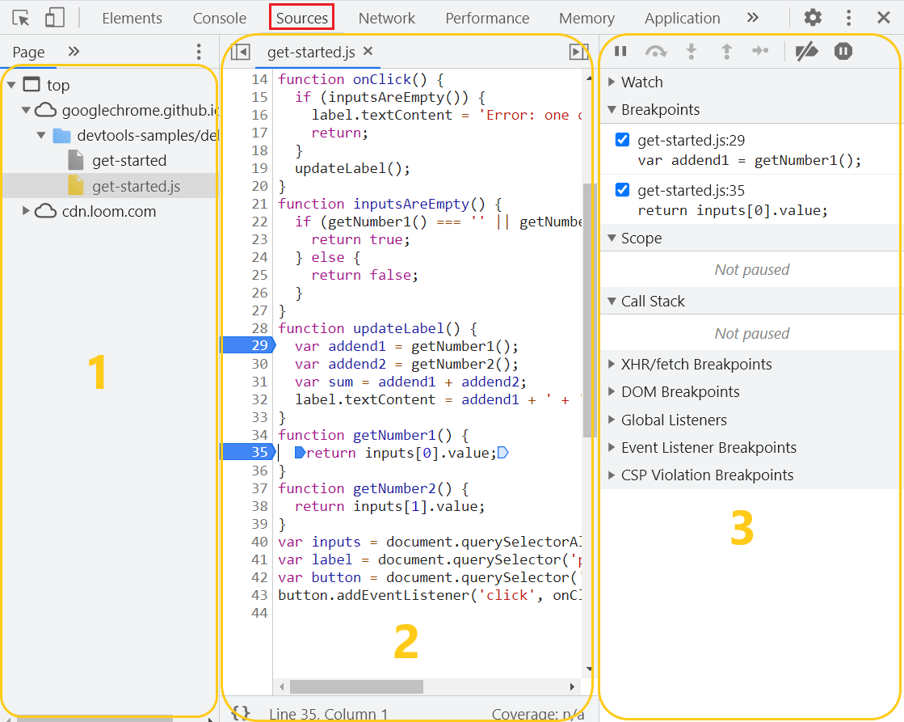
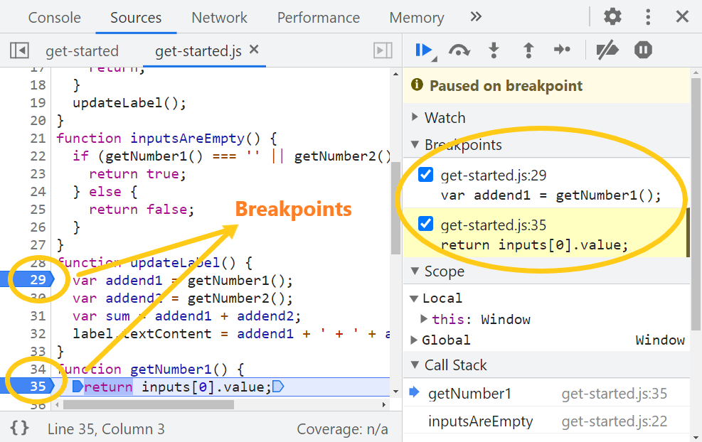
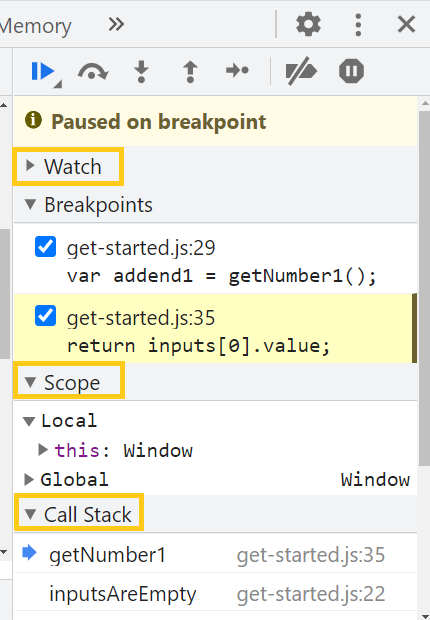
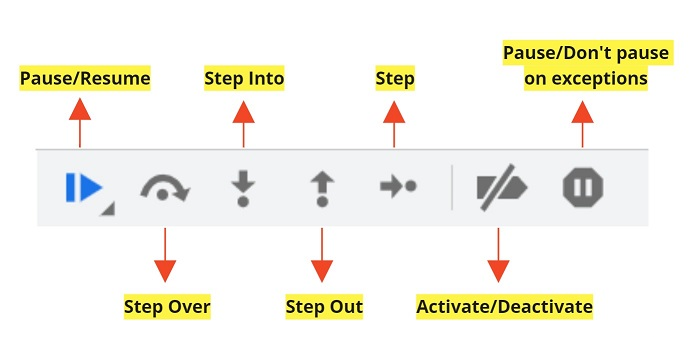

# Browser Dev Tools: Debugger

Una de las tantas opciones que nos ofrecen los navegadores dentro de sus herramientas para desarrolladores es el debugger ó "depurador". Esta herramienta nos permite encontrar y reparar errores en el código más fácil y rápidamente. Cuando nos iniciamos en el mundo de la programación una de las primeras cosas que aprendemos  en Javascript es a utilizar el console.log(). Si bien puede ser útil y sencillo de aplicar, tiene sus limitaciones. Con este método debemos abrir manualmente los archivos de código, buscar lugares estratégicos donde insertar los console.log() y luego volver a cargar la página ó ejecutar el código para ver los mensajes en la consola. Luego, debemos repetir esta acción por cada nuevo console.log() que queramos agregar, siendo esto lento y  poco práctico si necesitamos revisar archivos con muchas líneas de código o proyectos grandes. 
En este sentido el debugger tiene  algunas ventajas sobre el método log, ya que con él 
no sólo vamos a poder imprimir mensajes en la cosola si no que vamos a poder revisar el estado de nuestras variables y cómo van cambiando a lo largo de la ejecución. También podremos ver los contextos de ejecución que se van sumando al call stack por cada llamado de función entre muchas otras cosas. Asi también tiene una curva de aprendizaje un poco mayor. 

### ¿Dónde lo encontramos? </br>
Para eso tenemos que abrir el inspector en el navegador haciendo click derecho --> <b>Inspeccionar</b> ó con <b>F12</b></br>
En la pestaña <b>Sources</b> vamos a visualizar 3 secciones o paneles:



En el primero de ellos vamos a tener las carpetas con archivos que vamos a ejecutar y depurar con la herramienta debugger. En el panel del medio tenemos la vista completa de los archivos con el código y en el tercer panel tenemos los botones de control y los diferentes paneles más pequeños donde vamos a poder distinguir: 

* <b>Breakpoints:</b> son puntos en el código con los cuales le indicamos al debugger donde tiene que hacer pausas durante la ejecución. Mientras se pausa el código, podemos examinar las variables actuales, ejecutar comandos en la consola, entre muchas de otras acciones. Para colocar un breakpoint tenemos que hacer click en el número de linea de código donde queremos que el debugger frene la ejecución. En la siguiente imágen podemos ver que se han colocado BPs en las líneas 29 y 35 y a la derecha en el panel más pequeño nos indica en que líneas están. Desde ahí también podemos activarlos o desactivarlos de a uno. 



Tambien podemos crear breakpoints condicionales haciendo click derecho sobre el número de linea de código y aclarando que expresión queremos que se evalúe. En estos casos sólos se frenará la ejecución cuando la expresión evalúe en true. 

<b>Importante:</b> Vale mencionar que Js también nos ofrece de forma nativa una palabra reservada <a href=" https://developer.mozilla.org/es/docs/Web/JavaScript/Reference/Statements/debugger">debugger</a>
Esta sentencia funciona de igual manera que los breakpoints, vamos a colocarla en la linea de código donde queremos que se frene la ejecución. Si estamos en un editor de código es muy útil ya que no necesitamos abrir las herramientas de desarrollador en el browser para depurar el código. 

* <b>Scope:</b> en esta sección vamos a examinar que contienen las variables. Vamos a poder revisar  variables locales de la función, variables globales y sus valores.  También nos indica a qué apunta el this y variables de closure en caso que existan.

* <b>Call stack:</b> nos muestra las llamadas a las funciones apiladas, a medida que se van resolviendo salen de la pila. Si hacemos click en alguna de los elementos de la pila, nos posicionamos en esa función y podemos seguir inspeccionando el código desde ahi con los botones de control. Los veremos más adelante ⬇️

* <b>Watch:</b> podemos colocar cualquier tipo de expresión válida para javascript y al ejecutar el código esta se resolverá. Para agregarla hacemos click en el botón ➕ que está al desplegar la sección watch. Por ejemplo: si queremos saber el tipo de dato que está guardando una de nuestras variables podemos escribir la expresión --> <code>typeof "nombre de la variable"</code>, dependiendo del momento de la ejecución esto puede ir variando.



* <b>Event listener breakpoints:</b> en esta sección hay una lista de todos los diferentes tipos de eventos como clicks, mouse, animaciones, etc. Podemos colocar un breakpoint en el momento en que se dispara un evento determinado elegiendo desde este listado.

* <b>Barra de control:</b> en esta barra tenemos los botones que necesitamos para recorrer el código mientras la ejecución está pausada por los breakpoints. Veamos que hace cada uno de ellos.



1) <b>Pause/Resume:</b> con este botón podemos reanudar la ejecución del script una vez que fue frenada por un breakpoint. La secuencia de comandos continúa ejecutándose hasta que llegue al siguiente breakpoint, si es que lo hay.
2) <b>Step over:</b> nos permite pasar a la siguiente llamada de función. Es decir, pasa al siguiente llamado de función sin entrar en ella y detenerse en cada una de las líneas de código.
3) <b>Step into:</b> Nos metemos a inspeccionar una función. Podemos seguir recorriendo linea por linea el código dentro de ella.
4) <b>Step out:</b> Salimos de la función que estamos inspeccionado y saltamos a la siguiente linea de código en la ejecución.
5) <b>Step:</b> este botón funciona igual que step into (3) sólo que en caso de funciones asincrónicas, se comporta como antiguamente lo hacía en su versión de Chrome 63. Cuando nos paramos en una función asincrónica, devtools hará una pausa y luego saltará a la siguiente función, sólo mostrando el hilo principal de ejecución. En cambio, el botón Step into (3) cuando se para sobre una función asincrónica, nos llevará a revisar que pasa en la llamada a la función y luego seguiremos ejecutando la siguiente línea de código. Este botón puede no estar presente en dev-tools de otros navegadores.</br> 
Pueden ver una explicación más detallada sobre este punto acá: https://developer.chrome.com/blog/new-in-devtools-65/#async
6) <b>Activate/Deactivate:</b> Este botón no mueve la ejecución. Solo prende y apaga los breakpoints.
7) <b>Pause/Don't pause on exceptions:</b> con esta opción le indicamos al debugger si queremos que pause la ejecución en casos de excepción o no. Por ejemplo, si tenemos un error en el código y es por este motivo que se frena la ejecución, queremos que lo detecte. En este caso, se va a frenar la ejecución no por un breakpoint sino por un error extra que no habíamos tenido en cuenta así podremos examinar el estado de nuestras variables al momento que rompe y corregirlo.

Podés probar vos mismo/a como funciona el debugger con una demo de Google acá: https://googlechrome.github.io/devtools-samples/debug-js/get-started </br>
La explicación de la demo la encontras acá: https://developer.chrome.com/docs/devtools/javascript/

Además, en este mismo módulo vas a encontrar una carpeta `demo` que contiene un ejercicio para que descubras más funcionalidades del debugger. Acá te dejamos una muestra del código: 

```js
var obj = {
            fullname: 'Natalia Nerea',
            prop: {
                fullname: 'Aurelio De Rosa',  
                getFullname: function() {
                    return this.fullname;  //A qué apunta este this?
                }
            }
        };
        var test;
        function saludar( saludo, obj ){ //A qué apunta el this en este momento?
            test = obj.prop.getFullname() 
            return function( nombre, test ){
                alert(saludo + ' ' + nombre);
                console.log(test)  //Qué quedó guardado en la variable test?
            }
        }

        var saludarHola = saludar('Hola', obj); //Soy la primer llamada de función

        saludarHola('Toni', test); //Fijate que aparece en Scope cuando ejecutamos esta función...
```


No vas a ver nada en el navegador cuando abras el html. Tenés que abrir el inspector, pestaña sources y colocar los breakpoints en diferentes lineas de código. Donde vos quieras! Por ejemplo, podría ser en las lineas 17, 23, 25, 30 y 32. Fijate que va pasando en las subpestañas Call stack y Scope a medida que avanzas con los los botones del panel de control 😉


