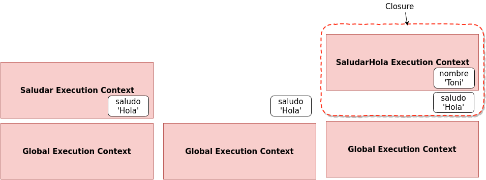
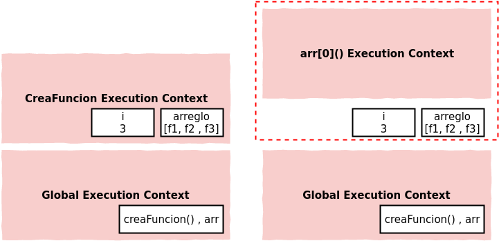
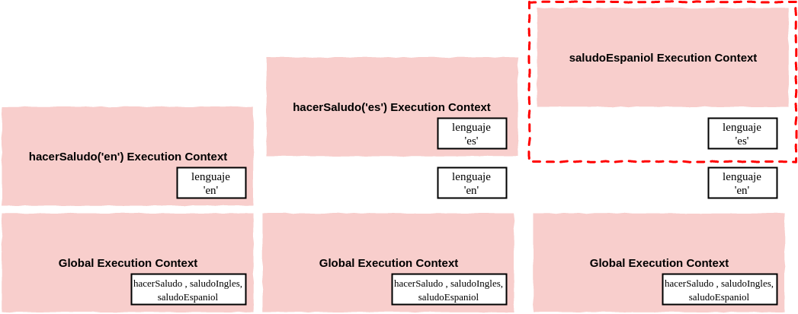

<table class="hide" width="100%" style='table-layout:fixed;'>
  <tr>
    <td>
      <a href="https://airtable.com/shr5KEX8NFdrG14j9?prefill_clase=02-JavaScriptAvanzado-II">
      
      <br>
      Hacé click acá para dejar tu feedback sobre esta clase.
      </a>
    </td>
      <td>
      <a href="https://quiz.soyhenry.com/evaluation/new/60662c1a656c8d23c2e60e66">
        
        <br>
        Hacé click acá completar el quizz teórico de esta lecture.
      </a>
  </td>
  </tr>
</table>

# JavaScript

#### Avanzado II

## Closures

Otro tema importante en JavaScript es `closures`. Veamos a que se refieren con un ejemplo:

```javascript
function saludar( saludo ){
  return function( nombre ){
    console.log(saludo + ' ' + nombre);
  }
}

var saludarHola = saludar('Hola'); // Esto devuelve una función

saludarHola('Toni'); // 'Hola Toni'
```

Veamos paso a paso lo que va a ocurrir cuando ejecutemos este código. Primero se creará el `contexto de ejecución global`, en esta etapa el interprete guardará espacio para la declaración de la función `saludar`. Luego, cuando se encuentra con la invocación a la función `saludar`, va a crear un nuevo contexto, y como vemos dentro de ese contexto la variable saludo va a tomar el valor que le pasamos por parámetro:`'Hola'`. El stack quedaría cómo está representado en la primera parte de la figura de abajo.



Luego de terminar de ejecutar y retornar una funcion (la que estamos guardando en `saludarHola`), ese contexto es _destruido_. Pero que pasa con la variable `saludo`?. Bueno, el interprete saca el contexto del stack, pero deja en algún lugar de memoria las variables que se usaron adentro (hay un  proceso dentro de JavaScript que se llama `garbage collection` que eventualmente las va limpiando si no las usamos. ). Por lo tanto, esa variable todavía va a estar en memoria (Segunda parte de la imagen).
Por último ejecutamos la función `saludarHola` y pasamos como parámetro el string `'Hola'`. Por lo tanto se crea un nuevo contexto de ejecucción, con la variable mencionada. Ahora, cómo adentro de la función `saludarHola` hacemos referencia a la variable `saludo`, el interprete intenta buscarla en su scope; Cómo `saludo` __no está definida en ese contexto__, el interprete sale a buscarla siguiente la `scope chain` y a pesar que el contexto ya no existe, __la referencia al ambiente exterior y a sus variables todavía existe__, a este fenómeno es que le llamamos _CLOSURE_. En el ejemplo, el _closure_ está definido por el rectángulo punteado de rojo. Las _closures_ no son algo que se escriban, o qué se le indique al interprete, simplemente son una _feature_ del lenguaje, simplemente ocurren. Nosotros no tenemos que pensar ni ocuparnos de mantener variables en memoria según el contexto de ejecucción en el que estemos, el interprete se encargará de esto siempre. Los _Closures_ nos van a permitir armar algunos patrones interesantes.

### Ejemplo Closures

```javascript
var creaFuncion = function(){
  var arreglo = [];

  for ( var i=0; i < 3; i++){
    arreglo.push(
      function(){
        console.log(i);
      }
    )
  }
  return arreglo;
}

var arr = creaFuncion();

arr[0]() // 3 sale un 3, qué esperaban ustedes??
arr[1]() // 3
arr[2]() // 3
```

¿Porqué el console log da todos `3`?

Para entenderlo veamos cómo se van creando los contextos de ejecución y donde van quedando los objetos que creamos.
En un primer momento se creará el contexto global, donde van estar definida la función `creaFuncion` y también el arreglo `arr`.

En un segundo momento, se va a crear el contexto de la función `creaFuncion` que fue ejecutada. Dentro de ella, se reserva espacio para un arreglo llamado `arreglo`, y para la variable `i`.



Cuando el interprete llega a la línea del `return`, se _destruye_ el contexto de ejecucción de `creaFuncion` y volvemos al contexto global. La siguiente ejecución que se produce es la de `arr[0]()`. Cabe notar que la variable `arr` _apunta_ o _hace referencia_ al arreglo `arreglo` que _vive_ en el contexto de `creaFuncion`, esto sucede porque los arreglos son _objetos_ y estos se pasan por referencia y no por valor. Como vemos, se crea el contexto de ejecución para esa función (`arr[0]`). Dentro de esta hay una referencia a la variable `i` , que también _vivia_ en el contexto de `creaFuncion`, ya destruido. Como el interprete no encuentra otra variable `i` dentro del nuevo contexto, sale a buscarla en sus referencias y ,como sabemos, la va a encontrar en el _closure_ que envuelve estas variables. Luego, ejecuta las siguientes funciones `arr[1]()` y `arr[2]()`, y en ambos casos sucede lo mismo. Justamente por eso, en cada console log, se imprimi el valor que tiene la variable `i`, que es `3` (el valor que quedó cuando se terminó el lazo dentro de `creaFuncion`).

Si quisieramos que cada función guardase el valor de `i`, deberíamos crear un _execution content_ donde se cree una variable nueva en cada iteración. Para eso vamos a usar una _IIFE_ a la cuál le vamos a pasar como parámetro `i`. Como estamos ejecutando la función, se va a a crear un contexto nuevo por cada ejecución, y por ende van a exisiter tres variables `j` (cada una en un contexto distinto) que contendrán los valores recibidos por parámetro (_1, 2 y 3_).

```javascript
var creaFuncion = function(){
  var arreglo = [];
  for ( var i=0; i < 3; i++){
    arreglo.push(
      (function(j){
        return function() {console.log(j);}
      }(i))
    )
  }
  return arreglo;
}

var arr = creaFuncion();

arr[0]() // 1
arr[1]() // 2
arr[2]() // 3
```

### Function Factory

Vamos a ver un patrón para crear funciones, muy usado en el desarrollo de frameworks, y que existe gracias a los _closures_.

Veamos el siguiente código, primero definimos una función que va retornar otra función (esta sería nuestra _fábrica de funciones_), esta recibe como parámetro el lenguaje del saludo, y retorna una función que salude (console loguee) en el idioma recibido.

```javascript
function hacerSaludo( lenguaje ){
  return function(){
    if ( lenguaje === 'en'){
      console.log('Hi!');
    }

    if ( lenguaje === 'es'){
      console.log('Hola!');
    }
  }
}

var saludoIngles = hacerSaludo('en');
var saludoEspaniol = hacerSaludo('es');
```

Si pensamos que ocurre cuando ejecutamos esas líneas, vamos a ver que se crearon dos closures. Uno para cada ejecución de la función `hacerSaludo`, en un closure la variable `lenguaje` contiene `es` y en el otro contiene `en`. Entonces, cuando invoquemos las funciones `saludoIngles` o `saludoEspaniol`, el intérprete va a salir a buscar la referencia a esa variable fuera del contexto de ejecución y la va a encontrar en el closure correspondiente.

O sea, que estamos usando el concepto de __closure__ para setear un parámetro para que viva sólo dentro de una función, además nadie puede ingresar al valor de `lenguaje`, esto agrega un poco de seguridad a nuestro código.



> Cada vez que invocamos una función se genera un execution context para esa ejecución. Si invocamos muchas veces la misma función ocurre lo mismo.

### Closures and Callbacks

Ahora que sabemos lo que son los _closures_, si pensamos en todo lo que hicimos algunas vez con JavaScript, es muy probable que nos demos cuenta que ya lo veniamos usando (tal vez sin saberlo).

Por ejemplo:

```javascript
function saludarMasTarde(){
  var saludo = 'Hola';

  setTimeout( function(){
    console.log(saludo);
  },3000)
};

saludarMasTarde();
```

En el ejemplo de arriba, cuando inocamos a `saludarMasTarde` estamos creando un execution context, en el que invocamos a la función `setTimeout` y donde definimos la variable `saludo`. Ese execution context es destruido, pero `setTimeout` contiene una referencia a `saludo`. Closure, Maybe?
Lo que realmente ocurre es que cuando pasan los tres segundos (esto lo hace algún componente externo al interprete), se lanza un evento diciendo que hay que ejecutar el callback, que es justamente una `function expression`. Entonces se crea un execution context para esa función, y dentro de ella se usa `saludo`, pero no está en ese contexto, entonces el interprete sale a buscarla afuera, y la encuentra en el `closure`!

O sea que se hicieron algo parecido a esto (tal vez usando eventos), entonces ya usaron _functions expressions_ y muy probablemente _closures_ tambien!

## Call, Apply and Bind

Cuando vimos el keyword `this`, dijimos que el interprete era el que manejaba el valor de este. Bueno, esto no es del todo cierto, hay una serie de variables que nos van a permitir poder setear nosotros el keyword `this`.

Como en JavaScript las funciones son un tipo objeto especial (vimos que tenian algunas propiedades especiales como `code` y `name`), estas también contienen métodos propios. Todas las funciones tienen acceso a los métodos:

* call()
* bind()
* apply()

Justamente invocando estos métodos vamos a poder tener control sobre el keyword `this`. Veamos algunos ejemplos:

```javascript

var persona = {
  nombre: 'Franco',
  apellido: 'Chequer',

  getNombre: function(){
    var nombreCompleto = this.nombre + ' ' + this.apellido;
    return nombreCompleto;
  }
}

var logNombre = function(){
  console.log(this.getNombre());
}
```

En este ejemplo, vamos a usar el keyword `this` para invocar el método del objeto persona. Como verán, el código de arriba produce un error, ya que cuando ejecutamos `logNombre()`, el `this` que está adentro hace referencia al objeto global, y ese objeto no tiene un método `getNombre`.

```javascript

var logNombrePersona = logNombre.bind(persona);
logNombrePersona();
```

La función `bind()` devuelve una __copia__ de la función, la cúal tiene internamente asociado el keyword `this` al objeto que le pasemos por parámtro. Si la llamamos sobre `logNombre` y le pasamos `persona` como argumento, vamos a ver que al ejecutar la _nueva_ función `logNombrePersona()` se va a loguear correctamente el nombre de `persona`.

Si usamos `bind()` entonces la nueva función queda __siempre__ ligada al objeto que pasamos cómo argumento. O sea que si quisieramos usarla para otro objeto, tendríamos que crear una nueva _copia_ de la función y _bindiarle_ un nuevo objeto.
Si ese es el caso, podríamos usar `call()`, veamos cómo funciona:

```javascript
logNombre.call(persona);
```

En este caso, estamos invocando la función original `logNombre`, pero con `call` le estamos indicando a qué objeto tiene que hacer referencia `this` dentro de esa función.

El primer argumento de `call` es el objeto a usar cómo `this`. Despues de este puedo pasar otros argumentos, que serán pasados a la función que estamos invocando. Por ejemplo, si nuestra función recibiera argumentos, usariamos `call` de la siguiente manera:

```javascript
var logNombre = function(arg1, arg2){
  console.log(arg1 +' '+ this.getNombre() +' '+ arg2);
}

logNombre.call(persona, 'Hola', ', Cómo estas?'); //Hola Franco Chequer , Cómo estas?
```

De hecho, la función `apply` es casi igual a `call`, excepto que recibe los argumentos de distinta manera. `apply` necesita dos arguemntos, el primero es el objeto a bindear con `this` (igual que `call`) y el segundo parámetro es un arreglo, en este arreglo pasamos los argumentos que va a usar la función que invocamos. Por ejemplo, para obtener el mismo comportamiento que arriba, pero con `apply`:

```javascript
var logNombre = function(arg1, arg2){
  console.log(arg1 +' '+ this.getNombre() +' '+ arg2);
}

logNombre.apply(persona, ['Hola', ', Cómo estas?']); //Hola Franco Chequer , Cómo estas?
```

Un arreglo puede ser más fácil de pasar cuando no sabemos a priori cuantos argumentos le voy a pasar.

> Vamos a usar `call` o `apply` según nos convenga para resolver el problema que necesitemos.

Vamos a usar estos métodos muchas veces cuando programemos, tal vez ahora no se imaginen un caso puntual, pero los habrá! se los aseguro!
Veamos un simple ejemplo donde podríamos usarlos, esto se conoce cómo __function borrowing__ (tomando prestadas funciones). Vamos a crear una segunda _persona_, pero que no tenga el método `getNombre` como la primera:

```javascript
var persona2 = {
  nombre: 'Manu',
  apellido: 'Barna'
};
```

Ahora, vamos a pedirle prestado el método `getNombre` a la primera _persona_ y la vamos a usar con la nueva.

```javascript
persona.getNombre.call(persona2); //'Manu Barna'
```

Con esto pudimos invocar un método de un objeto, pero usándolo con otro!

Veamos otro mini patron: _function currying_, este involucra `bind`.
Como `bind` crea una nueva función, si le pasamos parámetros, estos quedan __fijos__ en la nueva función. En el ejemplo no vamos a bindiar `this` con nada, pero si unos parámetros.
Digamos que tenemos una función que multiplica dos números recibidos por parámetro. Y nos gustaría construir una función que multiplique un número recibido por argumento por dos. Para esto podríamos usar `bind` y le pasamos cómo primer parámetro `this` (en este caso `this` hace referencia al contexto global), y como segundo parámetro un `2`. Guardamos el resultado en una nueva variable:

```javascript
function multiplica(a, b){
  return a * b;
}

var multiplicaPorDos = multiplica.bind(this, 2);
```

De esta forma, tenemos una nueva función donde el parámetro `a` es siempre `2`, gracias a `bind`. Nótese, que dentro de `multiplicaPorDos`, `this` sigue haciendo referencia al objeto global, porque cuando lo bindeamos le pasamos ese parámetro.

> Function Currying se refiere a crear una copia de una función pero con algunos argumentos preseteados. En JavaScript lo hacemos con `bind`.

## Homework

Completa la tarea descrita en el archivo [README](https://github.com/soyHenry/FT-M1/blob/master/03-JavaScriptAvanzado-II/homework/README.md)
