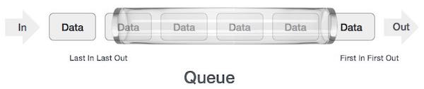

<table class="hide" width="100%" style='table-layout:fixed;'>
  <tr>
    <td>
      <a href="https://airtable.com/shr5KEX8NFdrG14j9?prefill_clase=03-EstructuraDeDatos-I">
      
      <br>
      Hacé click acá para dejar tu feedback sobre esta clase.
      </a>
    </td>
      <td>
      <a href="https://quiz.soyhenry.com/evaluation/new/6066323c656c8d23c2e60e75">
        
        <br>
        Hacé click acá completar el quizz teórico de esta lecture.
      </a>
  </td>
  </tr>
</table>

# Estructuras de Datos I


## Recursividad
  
Estando ante un problema una estrategia de resolución conocida es dividir los problemas en pequeñas partes mas fáciles de trabajar, esta técnica es llamada '_divide y vencerás_'(_divide and conquer_). Basándonos en esta estrategia se define la idea de recursividad o recurrencia, plantea la solución de un problema como la solución de pequeñas instancias del mismo problema por _repetición_.

Suponiendo que queremos sumar todos los números hasta un valor de corte pasado por parámetro, la función se vería algo así cierto?

``` javascript
> function sumar(num) {
    var tot = 0;
    for(var i=1; i<=num; i++) {
      tot += i;
    }
    return tot;
  }
```

Si analizamos un poco esta operación hay una linea clave que es la que hace el trabajo: `tot += i`

En esa ultima expresión tenemos la ejecución que va a resolver el problema, la repetición de esta linea hasta que se llegue al corte es lo que nos lleva a la meta. Entonces, podríamos decir que conociendo la situación en que debería cortar, a partir de ahora llamado __*caso base*__, solo tendríamos que repetirnos, y eso es exactamente como se compone una función recursiva.

``` javascript
  function recursiva(num) {
    
    // planteamos un caso base que cuando llegue a este retorne un valor
    if(`caso base`) return

    // acá pondríamos que operación se tendría que repetir, puede ser tan
    // simple como puedan imaginar o increíblemente compleja
    c = a + b

    // una vez realizada la operación lo que queda es repetirla hasta llegar
    // al caso base, entonces necesitamos una `llamada recursiva`.
    return recursiva(c)
    // y finalmete retornaria el resultado que vayamos devolviendo
  }
```

Este es un ejemplo muy básico de la estructura de una función recursiva (que no corre ni hace nada, es solo un ejemplo), que vemos que presenta los dos componentes infaltables en una recursion, el _caso base_ y la _llamada recursiva_. Veamos un ejemplo real con el problema anterior.

### Suma recursiva

Queremos sumar todos los números hasta un corte, entonces el caso base seria  cuando llegamos a 0 si sumamos desde el número y disminuyendo (porque así se me ocurrió en esta oportunidad), y nuestra llamada recursiva debería aparecer cuando ya sumamos y queremos que pase de número.

``` javascript
// vamos a crear la función con la variable `num` que me pasan por parámetro 
// y la variable `tot` que la voy a usar en la recursion e inicializo en 0
> function sumar(num, tot = 0) {
    // si mi número es menor igual `0` dejo de contar y retorno el total
    if(num <= 0) return tot;

    // si no sumo el número actual al total
    tot += num;
    num -= 1;

    // y finalmente realizo una nueva invocación
    return sumar(num, tot);
  }
```

¿Qué es lo que estaría pasando? Repasemos paso por paso para el ejemplo `sumar(4)`.

##### Primer invocación

1.1 - La función se ejecutaría creando su propio **scope** y recibiría el número 4 por parámetro.

``` javascript
Estado actual de las variables:
  num = 4;
  tot = 0;  // recien inicializado
```

1.2 - La comparación `num <= 0` da `false` como resultado, por lo que no entra al bloque

1.3 - `tot` suma `num` a su valor y disminuimos `num` en 1.

``` javascript
Estado actual de las variables:
  num = 3;
  tot = 4;
```

1.4 - antes de retornar un resultado tiene que resolver el stament `sumar(num, tot)` asique se invoca nuevamente la función.

##### Segunda invocación

2.1 - La función crea un segundo **scope** y recibiría dos parámetros 3 y 4

``` javascript
Estado actual de las variables:
  num = 3;
  tot = 4;
```

2.2 - La comparación `num <= 0` da `false` como resultado, por lo que no entra al bloque

2.3 - `tot` suma `num` a su valor y disminuimos `num` en 1.

``` javascript
Estado actual de las variables:
  num = 2;
  tot = 7;
```

2.4 - antes de retornar un resultado tiene que resolver el stament `sumar(num, tot)` asique se invoca nuevamente la función.

##### Tercer invocación

3.1 - La función crea un tercer **scope** y recibiría dos parámetros 2 y 7

``` javascript
Estado actual de las variables:
  num = 2;
  tot = 7;
```

3.2 - La comparación `num <= 0` da `false` como resultado, por lo que no entra al bloque

3.3 - `tot` suma `num` a su valor y disminuimos `num` en 1.

``` javascript
Estado actual de las variables:
  num = 1;
  tot = 9;
```

3.4 - antes de retornar un resultado tiene que resolver el stament `sumar(num, tot)` asique se invoca nuevamente la función.

##### Cuarta invocación

4.1 - La función crea un cuarto **scope** y recibiría dos parámetros 1 y 9

``` javascript
Estado actual de las variables:
  num = 1;
  tot = 9;
```

4.2 - La comparación `num <= 0` da `false` como resultado, por lo que no entra al bloque

4.3 - `tot` suma `num` a su valor y disminuimos `num` en 1.

``` javascript
Estado actual de las variables:
  num = 0;
  tot = 10;
```

4.4 - antes de retornar un resultado tiene que resolver el stament `sumar(num, tot)` asique se invoca nuevamente la función.

##### Quinta invocación (y ultima)

5.1 - La función crea un quinto **scope** y recibiría dos parámetros 0 y 10

5.2 - La comparación `num <= 0` da `true` como resultado, por lo que entra al bloque, entonces el quinto scope retorna un valor de 10.

Ese valor retornado llega como resultado del stament pendiente del scope 4 (`sumar(num, tot)`) entonces ese scope puede retornar el valor recibido.

Ese valor llega como resultado del stament pendiente del scope 3 (`sumar(num, tot)`) entonces ese scope puede retornar el valor recibido.

Y así sigue hasta que llegamos al primer scope creado, que finalmente retornara el valor `10` como resultado de toda la operación.

``` javascript
> sumar(4)
< 10
```

¿Se imaginan que pasaría si no hubiésemos puesto el `return` de la ultima linea?¿Con el primer `return` en el `if` alcanzara?

Pruebenlo!

### Números Naturales (N)

Los números naturales se definen como todos aquellos números mayores a cero sin decimales, o en una definición más matemática :

> Definimos que 0 es un _Natural_.

> Entonces un número `x` va a ser natural siempre que `x-1` sea un natural.

Para ejemplificar digamos que `x = 3`.

`x` es natural? va a ser natural si `x-1` es natural.

`x = 2` es natural? va a ser natural si `x-1` es natural.

`x = 1` es natural? va a ser natural si `x-1` es natural.

`x = 0` es natural? Si, porque definimos que 0 era natural.

Si analizamos este comportamiento, tiene una característica repetitiva como estábamos trabajando en las funciones recursivas, y hay un caso base que se define primero cuando decimos que 0 es natural.

¿Como podríamos armar una función recursiva con estas propiedades?

``` javascript
> function esNatural(num) {
    // planteo el caso base en el que llegamos a 0
    if(num === 0) return true
    // si no le pregunto si `num-1` es natural
    // lógicamente este ciclo se repetirá hasta llegar a 0
    return esNatural(num-1)
  }

> esNatural(0)
< true

> esNatural(7)
< true

> esNatural(1.5)
< Uncaught RangeError: Maximum call stack size exceeded
```

¿Qué paso? `Maximum call stack size exceeded` parece que superamos la cantidad de scopes posibles que podíamos generar al stack del `Event Loop`, esto se llama un _**stack overflow**_. Eso significa o que pedimos un número muy grande que no llego a terminar de resolverlo, o que se nos escapo un caso en el que debería cortar la recursion.

Veamos el momento del error, `esNatural(1.5)` por conocimiento previo sabemos que 1.5 no es un número natural, pero tenemos que ver como afecta esto nuestro algoritmo.

Una vez que vamos invocando la función el número va a llegar a `0.5`, al no entrar al `if()` va a realizar una nueva invocación y pasar al valor `-0.5`. A partir de ahí nunca va a llegar a entrar al condicional porque restando de a 1 a un número negativo nunca puede ser igual a `0`, va a seguir invocando la función hasta el menos infinito (o hasta que supere el _stack_).

El caso que nos falta es devolver `false` cuando un número no es natural, que es exactamente lo que estaba pasando recién, un número que restándole de a 1 nunca llega a ser igual a 0 no es un número natural.

``` javascript
> function esNatural(num) {
    if(num === 0) return true;
    // agrego una nueva condición para que no se pase de 0
    if(num < 0) return false;
    return esNatural(num-1);
  }

> esNatural(5)
< true

> esNatural(-2)
< false

> esNatural(1.5)
< false
```

Una de las contras que tiene este método es lo grave que son las fallas, como vieron, por olvidarnos un caso puede que creamos que el programa funciona correctamente y cuando no encontremos con situaciones no contempladas podemos colgar todo el programa sin poder detectar el error y trabajarlo. Por eso hay que ser cuidadoso jugando con funciones recursivas, nunca se olviden de evaluar todos los casos posibles.

## Estructuras de Datos

Cuando hablamos a estructura de Datos nos referimos a cómo organizamos los datos cuando programamos. Básicamente, este tema trata de encontrar formas particulares de  organizar datos de tal manera que puedan ser utilizados de manera eficiente.

Imaginen que los datos que tenemos que manejar son libros!, y en un principio tenemos muchísimos libros desordenados por casa. Cada vez que queremos leer un libro, tardamos dos horas buscando uno por uno hasta dar con el libro. Eso no es eficiente. Entonces, ¿qué hacemos? Bueno, podemos armar una biblioteca, por ejemplo, y acomodamos los libros en orden alfabético, esto nos ahorra tiempo en buscarlos. Y, ¿qué pasa si tenemos demasiados libros y no entran en una biblioteca? Podemos tener un lugar donde depositamos los libros que menos usamos, y mantenemos una libretita donde especificamos qué libros dejamos ahí y en que depósito están.
En fin, podemos organizarlos de mil maneras, pero se entiende la idea que organizando los datos vamos a ser más eficientes, no?

## Arreglos

El arreglo es una estructura de datos que ya conocían! Es tan usada, que muchos lenguajes la implementan de forma nativa, como javascript.
El arreglo es una colección finita de elementos que ocupan espacios contiguos de memoria, y se pueden acceder a cada uno de ellos a través de un índice.


Los arreglos nos sirven para guardar una colección de cosas (objetos, enteros, funciones, etc...) que tengan algo en común. Lo bueno de los arreglos es que la inserción es muy rápida, y es fácil acceder a un objeto si conocemos su índice. Pero no es tan bueno cuando tenemos que buscar un objeto en él, ya que tenemos que recorrerlo entero para encontrarlo. Borrar un elemento también es medio costoso.

## Sets

Un Set es una colección de elementos sin un orden en particular en donde _cada elemento puede aparecer una sola vez_. O sea, que es parecido a un arreglo, pero con la condición que cada elemento sea único.
En javascript los sets ya están implementados, y los podemos encontrar en la clase `Set`, acá esta la [documentación](https://developer.mozilla.org/en/docs/Web/JavaScript/Reference/Global_Objects/Set). Veamos un ejemplo:

```javascript
var arreglo = [1,2,3,4,4,5,5,1,2]
var set1    = new Set(arreglo)
console.log(arreglo)   // [ 1, 2, 3, 4, 4, 5, 5, 1, 2 ]
console.log(set1)      // Set { 1, 2, 3, 4, 5 }
```

## Pilas (Stack)

Esta estructura de datos es básicamente una _pila de cosas_. Vieron cuando tienen que lavar los platos: primero van poniendo un plato arriba del otro (armando la pila), después empiezan a sacar desde arriba para ir limpiando. Bueno, si se fijan bien el primer plato que ponen en la pila es el último que va a ser lavado, o bien, el último que entra es el primero que va a salir. Esto se conoce como una estructura tipo __LIFO__: _Last in, first out_.


Básicamente un stack tiene dos operaciones: `push()` y `pop()`, ya que sólo podés poner y sacar elementos en un orden definido, hace que no necesitemos más operaciones.
Podemos usar múltiples formas de implementar una Pila en javascript. Lo podemos hacer usando arreglos, una lista enlazada, o bien crear nuestra propia clase Pila.
Veamos como hacerlo usando arreglos:

```javascript
var stack = [];
stack.push(1);       // la pila es [1]
stack.push(10);      // la pila es ahora [1, 10]
var i = stack.pop(); // la pila [1]
console.log(i);      // muestra 10
```

## Cola (Queue)

Una cola, es una estructura en la cual el primer elemento que entra es el primer elemento que sale (como cuando hacemos una cola en el Banco :smile:). Esto es lo opuesto al comportamiento de una Pila, y se conoce como estructura tipo __FIFO__: _First in, First out_. La cola tiene dos métodos tambien: `enqueue()` y `dequeue()`, que sirven para encolar y 'desencolar' elementos.
Esta estructura la vamos a usar mucho para representar problemas de la vida real. Por ejemplo, si tuviera que hacer una app que desvie llamados de clientes a operadores, podríamos hacer una cola, donde vamos metiendo los clientes que van llegando, y cuando algún operador esté libre, sacar un cliente de la cola y pasarlo.



Veamos como podemos implementarlo en Javascript, igual que con Pilas, se puede hacer de muchas maneras. Vamos a mostrar la más simple, con arreglos:

```javascript
var queue = [];
queue.push(1);         // la cola es [1]
queue.push(2);         // la cola es [1, 2]
var i = queue.shift(); // la cola es [2]
console.log(i);        // muestra 1
```

Como ven, cuando construimos el set pasándole un [iterable](https://developer.mozilla.org/en-US/docs/Web/JavaScript/Reference/Iteration_protocols#iterable) nos devuelve un `Set` en donde cada uno de los elementos que contiene es único!

## Homework

Completa la tarea descrita en el archivo [README](https://github.com/soyHenry/FT-M1/blob/master/04-EstructuraDeDatos-I/homework/README.md)
