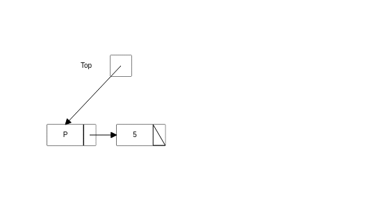
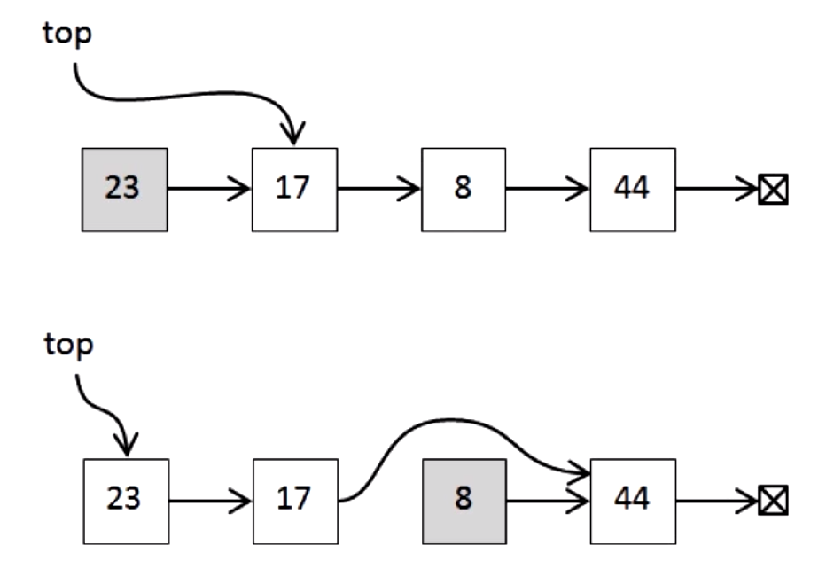
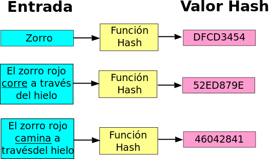

<table class="hide" width="100%" style='table-layout:fixed;'>
  <tr>
    <td>
      <a href="https://airtable.com/shr5KEX8NFdrG14j9?prefill_clase=04-EstructuraDeDatos-II">
      
      <br>
      Hacé click acá para dejar tu feedback sobre esta clase.
      </a>
    </td>
      <td>
      <a href="https://quiz.soyhenry.com/evaluation/new/606eed05656c8d23c2e60efa">
        
        <br>
        Hacé click acá completar el quizz teórico de esta lecture.
      </a>
  </td>
  </tr>
</table>

# Estructuras de Datos II

## Listas Enlazadas

Básicamente, las listas enlazadas, son una secuencia de nodos enlazados entre ellos y que contienen información. Podemos decir que cada nodo contiene datos y además uno o más links a otros nodos. Según las restricciones que tengan la cantidad de links, estas pueden ser simplemente enlazadas, dobles o múltiples.


¿Donde podemos usar una lista enlazada? Por ejemplo, si tenemos que modelar el plan de vuelo de un avión una buena posibilidad sería una lista enlazada de aeropuertos. O en el browser para poder ir hacia atrás y adelante en las páginas web del historial también podríamos usar una lista doblemente enlazada, o también las podes usar para representar un mazo de cartas para jugar blackjack. :smile:

### Lista Enlazada simple en Javascript

Hagamos nuestra primera lista enlazada.
Como cada nodo puede ser un objeto por sí mismo, vamos a codear dos constructores: el _nodo_ y la _lista_ en si.

El nodo contiene datos y un puntero o un link al siguiente nodo, por defecto el nodo no va a apuntar a ningún otro nodo.

```javascript
function Node(data) {
    this.data = data;
    this.next = null;
}
```

La clase lista, necesita sólamente un puntero o link que apunte al primer nodo de la lista. Adicionalmente vamos a agregar la propiedad length, para poder saber siempre la longitud de nuestra lista enlazada. Al crear una lista va a estar vacía por o tanto la cabeza es `null` y _length_ es cero.

```javascript
function List() {
    this._length = 0;
    this.head = null;
}
```

### Operaciones en una lista

Veamos que operaciones podemos hacer en una lista:

* _Iterar sobre la lista_: Recorrer la lista viendo sus elementos o hasta que encontremos el elemento deseado.
* _Insertar un nodo_: La operación va a cambiar según el lugar donde querramos insertar el nodo nuevo:
  * Al principio de la lista.
  * En el medio de la lista.
  * Al final de la lista.


_El orden en el que actualizan los punteros es muy importante. Si actualizan el la cabeza de la lista primero, pierden la lista!!_

* _Sacar un nodo_:
  * Del principio de la lista.
  * Del medio de la lista.





_Para sacar un item, directamente hacemos que no se pueda alcanzar desde el comienzo de la lista_

Implementación de la función insertar al final:

```javascript
List.prototype.add = function(data) {
    var node = new Node(data),
    current = this.head;
    // Si está vacia
    if (!current) {
        this.head = node;
        this._length++;
        return node;
    }
    // Si no esta vacia, recorro hasta encontrar el último
    while (current.next) {
        current = current.next;
    }
    current.next = node;
    this._length++;
    return node;
};
```

Escribamos algo para poder ver la lista que hemos creado y sus nodos:

```javascript
List.prototype.getAll = function(){
    current = this.head //empezamos en la cabeza
    if(!current){
        console.log('La lista esta vacia!')
        return
    }
    while(current){
        console.log(current.data);
        current = current.next;
    }
    return
};
```

Genial! Como ejercicio van a tener que implementar las demás funcionalidades ustedes mismos.

### Listas Doblemente Enlazadas

En la lista que vimos antes, sólo podemos recorrer la lista en un solo sentido. En algunos casos nos puede servir recorrer la lista en los dos sentidos, para tales casos lo que vamos a usar es una lista doblemente enlazada.
Como se puede imaginar, una lista doblemente enlazada es aquella que cada nodo tiene dos links, uno para el nodo siguiente, y otro para el nodo anterior.


Ahora es fácil ir y venir entre los items. Ahora las operaciones tienen un paso más, que es hacer que los nuevos links apunten al nodo correcto.

## Tablas Hash (Hash tables)

Esta estructura que guarda los datos de una manera asociativa, o sea con un par clave-valor o key-value. Los datos son guardados como en un arreglo, pero los índices tienen que ver con lo qué está guardado adentro. Esto hace que sean muy rápidas para buscar datos.



De hecho, la función que transforman un elemento en una cadena de longitud finita (a esto se lo conoce como _hash_) se llama función _hash_. El término hash proviene, aparentemente, de la analogía con el significado estándar (en inglés) de dicha palabra en el mundo real: picar y mezclar. Donald Knuth cree que H. P. Luhn, empleado de IBM, fue el primero en utilizar el concepto en un memorándum fechado en enero de 1953. Su utilización masiva no fue hasta después de 10 años.

Como las funciones hash nos devuelven un número finito de posibilidades, vamos a tener que reservar la misma cantidad de memoria para poder guardar cualquier cosa que, al ser hasheada, 'caiga' en esa key. Por lo tanto, las tablas hash van a ocupar más espacio, con el objetivo de ganar velocidad. De nuevo, según la naturaleza del problema te a convenir o no usarlas.

Para construir una hash table vamos a necesitar:

* _Una estrucura de datos_:  Acá vamos a guardar los datos y buscarlos por el índice. Puede ser un arreglo, o un árbol, etc..
* _Una función hasheadora_: Vamos a necesitar una función que nos transforme lo que elegimos de key a un hash que será nuestro índice.
* _Una política de resolución de colisiones_: Es la política que definiremos para decidir qué pasa cuando dos keys distintas generar dos hash iguales (las funciones no son perfectas !).

## Homework

Completa la tarea descrita en el archivo [README](https://github.com/soyHenry/FT-M1/blob/master/05-EstructuraDeDatos-II/homework/README.md)
