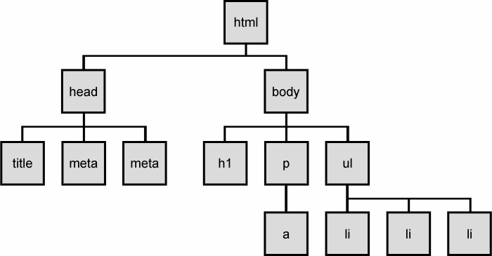

<table class="hide" width="100%" style='table-layout:fixed;'>
  <tr>
    <td>
      <a href="https://airtable.com/shr5KEX8NFdrG14j9?prefill_clase=05-EstructuraDeDatos-III">
      
      <br>
      Hacé click acá para dejar tu feedback sobre esta clase.
      </a>
    </td>
      <td>
      <a href="https://quiz.soyhenry.com/evaluation/new/60745c49656c8d23c2e610b7">
        
        <br>
        Hacé click acá completar el quizz teórico de esta lecture.
      </a>
  </td>
  </tr>
</table>

# Estructuras de Datos III

## Arboles (Trees)

Los árboles son estructuras de datos que consiste en una serie de nodos conectados entre ellos y que se asemeja a un árbol (al revés). Cuando hablemos de árboles vamos a usar la siguiente terminología:

* __Raíz__ - El nodo superior del árbol.
* __Padre__ - Nodo con hijos.
* __Hijo__ - Nodo descendiente de otro nodo.
* __Hermanos__ - Nodos que comparten el mismo padre.
* __Hojas__ - Nodos sin hijos.
* __Nivel__ - El nivel de un nodo está definido por el número de conexiones entre el nodo y la raíz.
* __Camino__ - Una secuencia de nodos por los que tenemos que pasar para llegar de un nodo a otro.

Para que una estructura de nodos sea un árbol tiene que ser dirigido (o sea que se pueda ir de un nodo al hijo, pero no al revés, como en las listas enlazadas), no tiene que tener ciclos ( o sea que no exista un camino para llegar de un nodo al mismo nodo sin pasar dos veces por otro nodo.), tiene que ser conexo, es decir que no haya nodos 'sueltos', y además dos nodos cualesquiera tienen que estar conectados _sólo_ por un único camino.

El siguiente no es un árbol porque tiene nodos no _conexos_:


Este otro no es un árbol porque tiene un ciclo:


Esta estructura es ampliamente usada, de hecho todos ustedes ya vienen trabajando hace mucho con una estructura de tipo árbol, ¿sabén de que les estoy hablando?



Sí, el DOM. La forma que usa el browser para mantener una representación del HTML en su cerebro es la de un árbol.

### Tipos de Arboles

En realidad, la definición de árbol es muy general, por ejemplo, una lista enlazada ES un árbol, cuyo root es la cabeza y cada nodo tiene un sólo hijo; es un caso _particular_ de un árbol. Es más, un árbol es un caso particular de un _grafo_.
También podemos definir al árbol de forma recursiva, ya que si lo pensamos, cada nodo ES un árbol, o sea que un árbol está formado por árboles; pero estos temas ya se vuelven muy filosóficos.
Veamos algunos tipos de árboles que vamos a usar.

### Árbol binario

Este es un árbol particular que tiene como característica que la cantidad de hijos que puede tener un nodo está restringida a dos (por eso se llama árbol binario).


Un árbol de este estilo puede estar _balanceado_ o no: vamos a decir que un árbol es _balanceado_ cuando la cantidad de nodos que haya a la izquierda del root sea igual (o no difiera en más de una unidad) a la cantidad de nodos en la parte izquierda.


Lo bueno de estos árboles, es que si se encuentra _balanceado_, necesitamos no más de _log n_ pasos para llegar a cualquier nodo! Esto los hace excelente estructuras de datos para guardar información que luego vamos a tener que buscar.

Veamos una manera rápida de implementar un árbol binario en Javascript usando arreglos. Básicamente lo que vamos a hacer es ir guardando cada nodo con sus hijos en una posición particular. Empezamos poniendo el nodo root como primer elemento del arreglo. Luego vamos a poner su hijo izquierdo en la posición 1 y el derecho en la 2. El hijo izquierdo de 1 iria en la posición 3 y el derecho en la 4. Los hijos de 2 irian en 5 y 6, respectivamente. En esta imagen se va a entender mejor:


Ahora, si lo pensamos cada hijo de un nodo está en la posición ubicado en `i*2+1` y `i*2+2` siendo `i` el índice del arreglo. Por lo tanto podemos implementar este árbol usando lo siguiente:

```javascript
izquierdo(i) = 2*i + 1 // el hijo izquierdo del nodo que está en i
derecho(i) = 2*i + 2   // el hijo derecho del nodo que está en i
```

### Arbol AVL

Los árboles AVL (por sus inventores  Georgy Adelson-Velsky y Evgenii Landis) es un árbol binario de búsqueda, pero que mantiene todo el tiempo al árbol _balanceado_. Básicamente lo que hace es, cada vez que se inserta o saca un nodo controla que todos los nodos estén balanceados. Y si no lo están reacomoda el árbol de tal forma que queden balanceados.


Lo malo de este árbol, es que las operaciones de insertar y sacar son muchos más caras que las de cualquier otra estructura. Pero nos da la posibilidad de estar __seguros__ que nunca vamos a tardar más de log n pasos en buscar un elemento. Según la naturaleza del problema que tengamos, nos va a convenir este método o no.

## Heap

Un heap es un árbol binario, con las condiciónes que cada nodo tiene que contener un valor igual o mayor que los de sus hijos y que sea completo, es decir que todas las hojas estén en el último nivel del árbol (o uno menos) y además que esté completo desde la izquierda.


Cuando se construye un heap al agregar cada valor, tenemos que buscar la posición que les corresponde. O sea, que en cada paso vamos a tener que ir reacomodando el árbol para que siga siendo un _heap_.

## Otras estructuras de Datos

Obviamente, existen muchas más estructuras de datos, estas son las más generales y las que todo ing. de software debe conocer. De todos modos, la mejor estructura de datos la vas a elegir según el problema que quieras resolver y después de investigar cuál es la que más te sirve.

## Tabla Resumen

Felicitaciones! has terminado la saga de estructura de datos (I - La amenaza recursiva, II - El ataque de las listas, III - La venganza de los trees).

Les dejo una tablita con ventajas y desventajas de las estructuras que hemos visto, para saber cuando utilizarlas y cuando no.

| Estuctura            | Ventajas      | Desventajas  |
| -------------------- |:-------------:| ------------:|
| Arreglo      | Rápida inserción, acceso muy rápido si conocemos el index. | Búsqueda Lenta, borrado lento. |
| Arreglo Ordenado      | Mejor búsqueda que el arreglo normal |   idem arreglo |
| Pila | Asegura LIFO      |   Acceso lento a los demás items |
| Cola | Asegura FIFO      |   Acceso lento a los demás items |
| Lista Enlazada | Rápida inserción, rapido borrado     |    Búsqueda Lenta |
| Árbol Binario | Muy rápido si está balanceado | Algoritmo de borrar es complejo, hay que balancear |
| Árbol Red-black | Rápido y siempre está balanceado      |    Es Complejo |
| Árbol 2-3-4 | Muy bueno para guardar datos  |   Es Complejo |
| Hash | Muy rápido si conocemos el key. Insercion rapida | Borrado lento, buscado lento, consume mucha memoria    |
| Heap | Rápida inserción, borrado y acceso al item mas grande |  Acceso lento a los demás items |

## Homework

Completa la tarea descrita en el archivo [README](https://github.com/soyHenry/FT-M1/blob/master/06-EstructuraDeDatos-III/homework/README.md)
