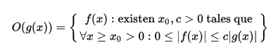
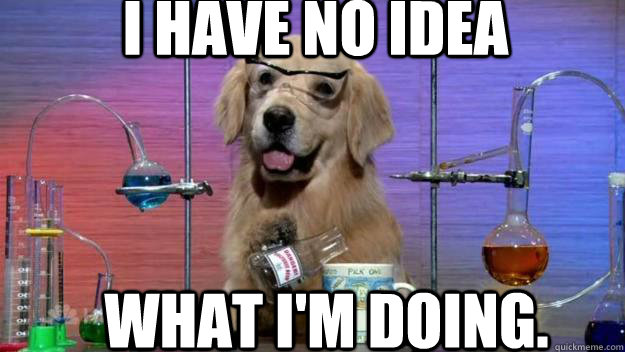
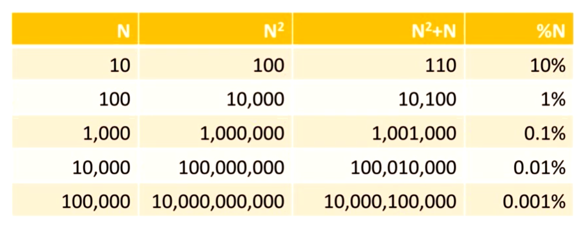
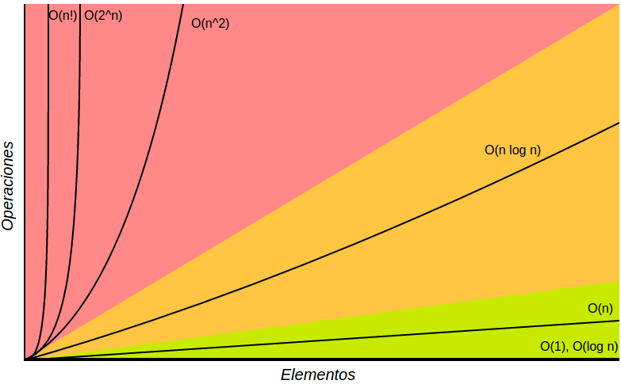
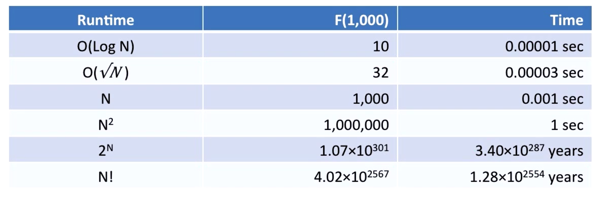
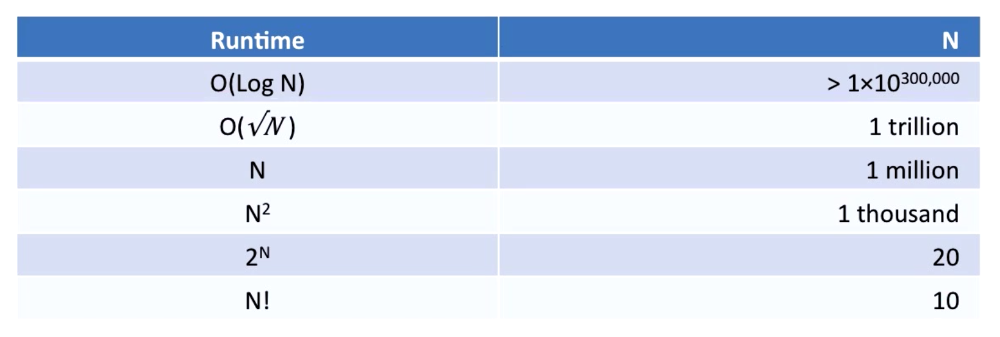
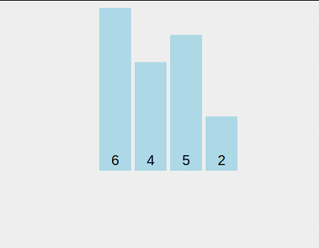
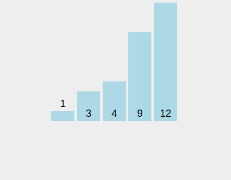
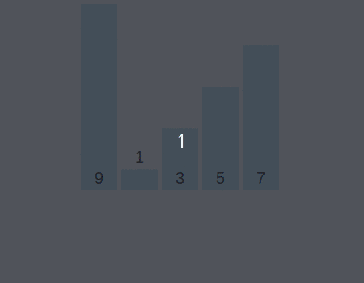
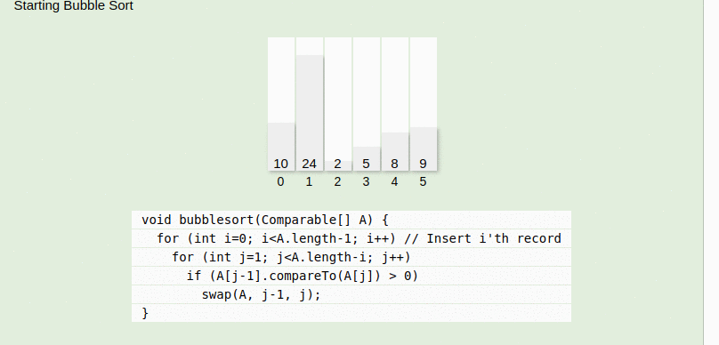

<table class="hide" width="100%" style='table-layout:fixed;'>
  <tr>
    <td>
      <a href="https://airtable.com/shr5KEX8NFdrG14j9?prefill_clase=06-Algoritmos-I">
      
      <br>
      Hacé click acá para dejar tu feedback sobre esta clase.
      </a>
    </td>
      <td>
      <a href="https://quiz.soyhenry.com/evaluation/new/6053bc3f656c8d23c2e60e16">
        
        <br>
        Hacé click acá completar el quizz teórico de esta lecture.
      </a>
  </td>
  </tr>
</table>

# Algoritmos I

## ¿Qué es un algoritmo?

Un algoritmo es un conjunto prescrito de instrucciones o reglas bien definidas, ordenadas y finitas que permite realizar una actividad mediante pasos sucesivos que no generen dudas a quien deba realizar dicha actividad.
O sea, una serie de pasos a seguir para completar una tarea.

Por ejemplo, podés tener un algoritmo para ir desde tu casa al trabajo:

1. Salir de casa
2. Tomar Subte
3. Tomar Bondi
4. Caminar

O para hacerte el desayuno también:

1. Buscar Pan
2. Prender tostadora
3. Esperar N segundos
4. Comer Tostada

En `Ciencias de la computación` los algoritmos van a ser los pasos que la computadora tiene que _seguir_ para poder completar una tarea. Conocer y encontrar buenos algoritmos y saber cuando utilizarlos es una de las prácticas fundamentales en esta ciencia.

Algunos ejemplos de la vida real:  ¿Cómo hace Skype para transmisir audio y video en tiempo real por internet? _Utilizan algoritmos de compresión de audio y video en ambos extremos de la comunicación!_

## Un algoritmo para salir de un laberinto

Pensemos en un juego, la idea es salir de un laberinto (uno no muy complicado) en la menor cantidad de pasos posibles. Veamos el siguiente laberinto y pensemos como escapar:

```js
XXXXX XX
X      X
X XXXX X
X XOX  X
X X XX X
X X X  X
X      X
XXXXXXXX
```

Las X representan paredes que no se pueden atravesar, y la O el personaje que quiere escapar del laberinto. La salida se encuentra en la pared de arriba. El personaje solo se puede mover en linea recta, no en diagonal.

Como podriamos diseñar un algoritmo que nos permita calcular la menor distancia para salir del laberinto?
Pensemos esta solución:

1. Empezemos desde el casillero de salida y lo marquemos con el número cero.
2. Busquemos todos los casilleros que estén a un movimiento de la salida y lo marquemos como uno.
3. Ahora a los que están a dos movimientos.
4. Y así sucesivamente a los que estén a n+1 movimientos, hasta que hayamos completado todo el tablero.

```js
XXXXX XX  XXXXX0XX  XXXXX0XX  XXXXX0XX
X      X  X      X  X    1 X  X   212X
X XXXX X  X XXXX X  X XXXX X  X XXXX X
X XOXX X  X XOXX X  X XOXX X  X XOXX X
X X XX X  X X XX X  X X XX X  X X XX X
X X X  X  X X X  X  X X X  X  X X X  X
X      X  X      X  X      X  X      X
XXXXXXXX  XXXXXXXX  XXXXXXXX  XXXXXXXX
```

```js
XXXXX0XX  XXXXX0XX  XXXXX0XX  XXXXX0XX
X  3212X  X 43212X  X543212X  X543212X
X XXXX3X  X XXXX3X  X XXXX3X  X6XXXX3X
X XOXX X  X XOXX4X  X XOXX4X  X XOXX4X
X X XX X  X X XX X  X X XX5X  X X XX5X
X X X  X  X X X  X  X X X  X  X X X 6X
X      X  X      X  X      X  X      X
XXXXXXXX  XXXXXXXX  XXXXXXXX  XXXXXXXX
```

```js
XXXXX0XX  
X543212X  
X6XXXX3X  
X7XOXX4X  
X8XCXX5X  
X9XBX76X  
XABA987X  
XXXXXXXX  
```

Ahora que tenemos un _mapa_ del laberinto, tenemos que mejorar el algoritmo para que el personaje camine siguiendo el mapa:

1. Desde el punto donde está el personaje, buscar el casillero adyacente con menor distancia.
2. Avanzar hacia ese casillero.
3. Repetir hasta llegar a la meta (distancia cero).

Listo! hemos creado un algoritmo capaz que salir de un laberinto!

_Le encuentran algún problema a cómo está definido el algortimo? Podría fallar en este ejemplo? Lo podrían implementar en javascript?_

## ¿Qué hace bueno a un algoritmo?

1. Resuelve un problema: Este es el objetivo principal del algoritmo, fue diseñado para eso. Si no cumple el objetivo, no sirve para nada :S.
2. Debe ser comprensible: El mejor algoritmo del mundo no te va a servir si es demasiado complicado de implementar.
3. Hacerlo eficientemente: No sólo queremos tener la respuesta perfecta (o la más cercana), si no que también queremos que lo haga usando la menor cantidad de recursos posibles.

De hecho estas dos condiciones a veces van en contra: encontrar la solución perfecta atenta contra el tiempo que va a tardar, y hacerlo rápido atenta contra la precisión de la respuesta. Vamos a tener que saber qué usamos en cada caso!

### ¿Cómo medimos la eficienta del un algoritmo?

Lo más fácil y rápido de hacer es contar cuanto tiempo le lleva al algoritmo encontrar la respuesta que buscamos. Pero eso nos diría la eficiencia de ese algoritmo sólamente para la computadora que corrió , con los datos que tenia y en el lenguaje que se haya implementado, no?
Entonces... como hacemos para _comparar_ la eficiencia de distintos algoritmos?
Para eso se hace un análisis conocido como `Asymptotic Analysis`, vamos a entender el concepto con un juego.

#### Adivinando un número

Hagamos un pequeño juego para ver cómo distintos approachs a un mismo problema pueden tener distintas eficiencias, de hecho, para jugar vamos a crear un _algoritmo_ mental que vamos a seguir hasta ganar el juego.

Vamos a elegir aleatoriamente un numero entre una lista de números del 1 a 16. La persona que adivine ese número en la menor cantidad de pasos será el ganador. En cada caso, el que conoce el número dirá si el número adivinado es mayor o menor que el objetivo.

Empezemos a jugar. Cada uno va a intentar adivinar y nos va a contar qué técnica utilizó para agrandar sus chances de ganar.

#### Búsqueda Linear

Digamos que no queriamos pensar mucho, y decidimos atacar el problema con lo que se conoce como __Fuerza Bruta__, es decir, intentar de a una cada una de las soluciones posibles hasta dar con el resultado. En ese caso podríamos decidir empezar desde el 1 o el 16, e ir probando uno por uno hasta dar con el número. Ahora intentemos calcular de antemano cuantas veces tendríamos que adivinar para ganar, bueno dependiendo de nuestra suerte podriamos ganar en un paso (El número ganador es el 1 o el 16 y empezamos por ese extremo), o si la suerte no está de nuestro lado, el peor caso sería de 16 (el número es 1 o 16, pero empezamos por el extremo opuesto). Entonces podemos ganar el juego en una cantidad de veces que esté entre 1 y 16, no? De hecho si jugaramos muchas veces (como el que elige el número lo hace de forma aleatoria y están igualmente distribuidas las probabilidades) nos vamos a dar cuenta que __en promedio__ vamos a ganar el juego en 8 veces.

Ahora, como podriamos hacer para bajar la cantidad de veces que en promedio necesitamos? Bueno, como el que sabe el número nos dice si el número que elegimos es mayor o menor, podemos hacer uso de eso para optimizar nuestro juego. Tenemos que pensar lo siguiente: ¿Qué número tengo que elegir para obligar al que sabe el número a que descarte la mayor cantidad de números __EN PROMEDIO__?  Si pensamos en el número mas cercano al medio, estamos en lo correcto. Al quedar la mayor cantidad de número a la derecha y a la izquierda del número central, aprovecharemos al máximo la información que nos da el que sabe el número.
Ahora pensemos el mejor y el peor caso. De nuevo, si tenemos mucha suerte, y el número ganador es el central, vamos a ganar en una sólo jugada!
Ahora, en el peor de los casos vamos a ir dividiendo la lista en dos, hasta qué sólo quede un sólo número: el ganador!
Por ejemplo:

Aleatoriamente el número que salió es el __9__

```js
1-2-3-4-5-6-7-8-9-10 <- elegimos el 5  / 10 posibilidades

~~1-2-3-4-5-~~6-7-8-9-10 <- elegimos el 8  / 5 posibilidades

~~1-2-3-4-5-6-7-8~~-9-10 <- elegimos el 10 / 2 posibilidades

~~1-2-3-4-5-6-7-8-~~9~~-10~~ <- El número era el 9! / 1 posibilidad
```

En cada paso vamos a ir dividiendo la lista en dos, hasta que nos quedamos con una lista de sólo un número, en tal caso estamos seguros que es el número ganador. Para averiguar la cantidad máxima de pasos necesario vamos a necesitar un poco de matemáticas:

Sabemos que el número máximo de veces que vamos a necesitar sale de la cantidad de veces que podemos dividir la lista en dos hasta que el resultado sea uno, no? Lo podemos escribir en forma matemática así:

```js
1 = N / 2x // N es el largo de la lista y x el número que buscamos
```

Para despejar la potencia usamos logaritmo:

```js
log2(2x)    = log2 N
x * log2(2) = log2 N
x * 1         = log2 N
```

Por lo tanto, el número que necesitamos es el log en base dos de N, como N era 16 en nuestro ejemplo, el número máximo de pasos será de 4.

Al ser 1 y 4 los casos extremos __en promedio__ vamos a necesitar tan sólo de dos jugadas hasta adivinar el número. Sorprendente, no? Pasamos de necesitar 8 pasos en promedio a dos! Eso es eficiencia!

Este algoritmo de búsqueda se conoce como __Binary Seach__ y se dice que tiene una complejidad de logaritmo de N, en cambio la fuerza bruta tiene complejidad N.

__¿Cuantos pasos cómo máximo necesitan para encontrar un número en una lista de 300 números? ¿Y en una de 1000?__

### Complejidad de un algoritmo

En general nos interesa conocer qué tan _complejos_ son los algoritmos, o en realidad, lo contrario: que tan __eficiente__ es un algoritmo.
Hay muchos aspectos que afectan la complejidad de un algoritmo:

* Tiempo
* Espacio
* Otros recursos:
  * Red
  * Gráficos
  * Hardware (Impresoras, Cpus, Sensores, etc...)

La mas común, y en la que nos vamos a concentrar mayormento es la complejidad de tiempo, es decir la _velocidad_ algoritmo, o cuanto tarda en correr. Otro tipo de complejidad importante es el espacio, o sea la cantidad de memoria (RAM o disco) que necesitamos para poder corer un algoritmo. De hecho, a veces cambiamos la complejidad de tiempo por la de memoria, un algoritmo va a consumir más espacio en memoria, pero va a correr más rápido (Hash tables!).
Otros algoritmos pueden requerir otros recursos, como por ejemplo algún algoritmo que se ejecute distribuido por la red, en ese caso el algoritmo se verá limitado por la velocidad y tamaño de la misma. Otro usarán otros tipos de recursos.

### Circunstancias

Como nos podemos imaginar, un mismo algoritmo puede tardar mucho o poco según el caso y los datos que se usan como input. Por ejemplo, un algoritmo para ordenar puede tardar muy poco si los datos que tienen que ordernar ya vienen ordenados! O puede tardar muchísimo si vienen ordenado en el orden inverso del que queremos, por ejemplo.
Entonces, para cada algoritmo podemos considerar su complejidad en las siguientes circunstancias:

* Todos los casos
* Mejor Caso
* Caso Promedio
* Peor Caso   <- Si no tenemos idea de como pueden venir los datos, debemos ver este caso.
* Caso Esperado  <- Si conocemos el dominio del problema y sabemos con algún grado de certeza como van a venir los datos, nos concentramos en este caso.

Ahora... ¿Por qué nos importa medir la complejidad de los algoritmos? Básicamente nos va a servir a:

1. Predecir el comportamiento: hay casos donde algo puede tardar tanto que no tenemos el lujo del prueba y error, tenemos que conocer de antemano si un algoritmo va a terminar en un tiempo adecuado para el problema.
2. Compararlos: Según el problema vamos a tener que decidir cuál es el mejor algoritmo para usar, tampoco podemos ponernos a probar uno por uno.

### Cota superior asintótica ( Big O Notation / Notación O grande )

Vamos a usar una función que sirve de cota superior  de otra función cuando el argumento tiende a infinito.



Una función f(x) pertenece a O(g(x)) cuando existe una constante positiva c tal que a partir de un valor x0, f(x) no sobrepasa a cg(x). Quiere decir que la función f es inferior a g a partir de un valor dado salvo por un factor constante.



No se preocupen! es mucho más simple que eso. La notación _O grande_ intenta analizar la complejidad de los algoritmos según crece el número de entradas ( _n_ ) que tiene que analizar, en general es el tamaño del dataset que usa como entrada. Y lo que busca es una función que crezca de una forma con respecto a _n_ ( # de entradas ) tal que nuestro algoritmo nunca crezca más rápido que esa función, aunque si puede crecer más lento. Básicamente, estamos buscando algo para poder decir: mirá este algoritmo nunca va a tardar más que esto, capaz tarda menos, pero más no.
Esto nos va a servir mucho, porque vamos a poder decidir si un algoritmo es bueno o no en función de la cantidad de datos que vamos a analizar, por ejemplo: si tuvieramos que ordenar dos números, seguramente cualquier algoritmo que usemos lo va terminar en un par de milisegundos, si tenemos que ordenar 10 o 100 tambien... pero si tenemos que ordernar 1.000.000 de números ya cambia la cosa, habrá algoritmos que los ordenen en segundos y otros que pueden llegar a tardar horas! En fin, según el problema vamos a poder decidir que necesitamos.

#### Cómo calculamos la O grande de un algoritmo?

Sigamos esta lista de pasos para entender rápidamente cuál es la función superior o sea la O() de un algoritmo:

1. Si un algoritmo hace f(n) pasos para encontrar el resultado, entonces decimos que ese algoritmo es O( f(n) ).
2. Si un algoritmo hace f(n) pasos seguido por g(n), entonces es O( f(n) + g(n) ).
3. Si f(n) > g(n), podes simplificar diciendo que O( f(n) + f(n) ) = O( f(n) ).( también podes obviar constantes)
4. Si el algoritmo hace g(n) pasos por cada f(n) pasos, entonces este algoritmo es O( f(n) x g(n)).
5. Ignorar constantes multiples: O( Cxf(n) ) = O( f(Cxn) ) = O( f(n) )

##### Ejemplos

Regla tres: Si una función es más grande que la otra podés _'redondear'_ y tomar la función más grande. Miren este caso:



Fijensé cúan importante es N cuando el tamaño crece (que es justamente el caso que nos interesa).

Encontrar un máximo en un arreglo:

```js
var max = array[0];
for( var i = 0; i <= array.length; i++){
 if( array[i] > max) {
  max = array[i];
 }
}
console.log(max);
// O ( N ) 
```

Máximo y Mínimo:

```javascript
var max = array[0];
for( var i = 0; i <= array.length; i++){
 if( array[i] > max) {
  max = array[i];
 }
}
var min = array[0];
for( var i = 0; i <= array.length; i++){
 if( array[i] < max) {
  min = array[i];
 }
}

console.log(max);
console.log(min);
}; // O( N + N) = O(2N)
```

Mejorando un algoritmo:

```javascript
var max = array[0];
var min = array[0];
for( var i = 0; i <= array.length; i++){
 if( array[i] > max) {
  max = array[i];
 }
 if( array[i] < min){
  min = array[i]
 }
}
console.log(max);
console.log(min);
}; // O( N ) = O(N)
```

Buscar elementos iguales en un arreglo:

```javascript
for( var i = 0; i <= array.length; i++){
 for( var j = 0; j <= array.length; j++){
   if(array[i] === array[j]){
    return true;
   }
 }
};// O( N x N) = O (n²)
```

#### Ejemplos de Funciones Típicas

##### O(1)

Una operación simple es O(1), o sea que siempre tarda lo mismo.
Por ejemplo

```javascript
var max = 10;
```

Ojo, no importa si tuviesen un millón de declaraciones de variables, como siempre tarda lo mismo en correr el algoritmo sigue siendo O(1). No importa que tarde más cuando haya más declaraciones, importa que no tarde más para mayor cantidad de entradas.

##### O(n)

Generalmente hace una acción por cada entrada.

Ej:

```javascript
array.forEach( function(elem){
 console.log(elem * 2);
})
```

##### O(n²)

Para por cada entrada, recorre todas las entradas de nuevo.

Ej:

```javascript
array.forEach( function(elem){
 array.forEach( function(elemdos){
  console.log(elem * elemdos);
 })
})
```

##### O(nc) N elevado a la c

Es el concepto general del anterior, por cada entrada el algoritmo recorre todas las demás entradas c veces.

##### Otros O

Tambien podemos encontrar algoritmo que sean O de la raiz de N, ó O de N elevado a un medio.

##### O ( log N )

Es el caso del juego de búsqueda que hicimos! se aplica en problemas donde en cada paso tenemos que recorrer la mitad de las entradas que quedan.

##### O ( N! ) El horror, hermano


N factorial, quiere decir: N *N-1* N-2 *N-3* ... * 1 .
Por ejemplo: 4! = 4\*3\*2\*1 = 24

Esta complejidad en general aparece en algoritmos que acomodan items, porque hay n! formas de acomodar N items.
Por ejemplo, si tengo los número 1,2 y 3. Puede haber 3! combinaciones distintas:

```js
(1,2,3)
(1,3,2)
(2,1,3)
(2,3,1)
(3,1,2)
(3,2,1)
```

#### Comparación Gráfica



En la imagen de arriba podemos ver una comparación gráfica de las distintas complejidades de los algoritmos.

Si tuvieramos una compu es capaz de ejecutar 1.000.000 instrucciones por segundo (un poco optimista para las compus de hoy) , veamos cuanto tiempo tardarían algoritmos de distinta complejidad  en terminar de correr con un N de entrada de 1000.



Sorprendente, no? Miren [esto](https://es.wikipedia.org/wiki/Torres_de_Han%C3%B3i#Historia)

Ahora pensemos el problema al reves. ¿Qué cantidad de datos podría procesar cada algoritmo en un segundo?:



Al primero podemos tirarle la cantidad de datos que quisieramos! (de hecho tendriamos un problema de memoria, más que de tiempo).
A los últimos los vamos a poder usar sólamente con entradas que sean muy pequeñas... si no, vamos a tener que esperar mucho tiempo...

### Problemas P y NP

__P - Tiempo polinómico__: Si la cantidad de operaciones que necesita un algoritmo para terminar es un polinomio (no importa si es muy grande), decimos que el algoritmo termina en tiempo polinómico. Además, si para llegar al resultado realiza una cierta cantidad de pasos, y siempre va a realizar los mismos, podemos decir que el algoritmo es __deterministico__. Esto es bueno, quiere decir que podemos calcular cuanto va a tardar a priori.

__NP - Tiempo polinómico no deterministico__: Estos algoritmos, no son _deterministicos_, esto se debe a que encontrar la solución real nos puede llegar a tomar _muchísimo_ timepo! Entonces para resolverlos, lo que hacemos es ir probando algunas soluciones, o descartando las soluciones que sabemos que no son soluciones.
A este lo vamos a entender con un ejemplo:
Imaginen que nos dan un set de número y nos preguntan si algún subset del set suma 0:

```js
{-10, 60, 95, 25, -70, -50}
solucion 1: -10 + -50 + 60 = 0
```

En este caso, fue fácil descubrir un subset, pero si el set hubiese sido más grande nos hubiese costado mucho poder afirmar que existe o no un subset que sume cero, de hecho la complejidad de este algoritmo seria de O(2n). Lo importante es que podemos determinar si una solución es correcta o no usando de forma _determinítica_ (haciendo la suma), por lo tanto podriamos crear un algoritmo no determinístico, que eliga al azar una seria de números y los sume para ver si dan cero. De esta forma, podríamos encontrar _algunas_ soluciones, pero nunca vamos a estar seguros de haber encontrado __todas__.

Ahora, piensen que en algún momento alguien puede descubrir (o inventar ) un algoritmo que resuelta este problema en tiempo deterministico, de ahí viene la pregunta filosofica que se hacen los matemáticos computacionales:

```js
P = NP ?
```

## Algoritmos de búsqueda

Buscar algo en un conjunto de cosas es una tarea con la que nos encontramos todo el tiempo cuando progamamos, por lo tanto, no nos sorprende que los algoritmos más usados (y por lo tanto más estudiados ) son los algoritmos de búsqueda. Es importante conocer estos algoritmos ya que para crearlos se usarón técnicas que también nos van a servir para resolver otro problemas y también vemos como aprovechan ciertas estructuras de datos.

También nos sirve conocer varios métodos de algoritmos, ya que cada uno se comporta distinto según tenga que ordenar números, textos u objetos. También cambia el comportamiento según la naturaleza del conjunto a ordenar, ya que este puede venir parcialmente ordenado, bastante ordenado, o capaz ordenado de una manera totalmente aleatoria; esto puede afectar mucho el tiempo de ejecución de algunos algoritmos.

Veamos algunos algoritmos:

### InsertionSort

Este es tal vez uno de los más simples, y consiste básicamente en extraer el elemento del conjunto y agregarlo en la posición que le corresponde según el ordenamiento que estemos usando. Para hacerlo el algoritmo tiene que ir viendo cada uno de los elementos que ya están y compararlo con el extraido, hasta encontrar la posición que corresponde.



Siendo así, y analizando el peor caso (sería que cada elemento que saquemos vaya al final de la lista): para el primero necesitariamos N pasos, para el segundo N-1, para el tercero N-2 y así sucesivamente. Esto es una suma triangular, y se puede demostrar que el resultado es `n * (n+1) /2`

```js
       n+1
#   | #     ###   ####
##  | ##  +  ## = #### n  // La cantidad de puntos es n * (n+1)
### | ###     #   ####    // Y los que teniamos al comienzo es la mitad de eso
```

O sea que para el peor caso este algoritmo tiene una complejidad de `O(n²)`. Y en el mejor de los casos, donde ya estaban ordenados los elementos, tiene que recorrer todos los elementos una vez, por lo tanto en el mejor caso tiene complejidad `O(n)`.



O sea este algoritmo nos puede servir en el caso que sepamos que los datos pueden venir _casi_ ordenados!

### Selection Sort

Selection Sort intenta ordenar por posición, es decir empieza en la posicion mínima y busca el elemento que corresponde a ese lugar. Básicamente, empieza buscando el primer mínimo (si ordenamos en forma creciente ) y lo pone en la primera posición, luego para la segunda posición vuelve a buscar el mínimo pero dentro de los elementos que quedan, así sucesivamente hasta que no quedan elementos por ordenar.



O sea que para cada elemento de la lista, tenemos que recorrer n-1 elementos restantes. Por lo tanto, la primera vez vamos a recorrer `n` elementos, la segunda vez `n-1` y así. O sea que estamos en un caso muy parecido al insertionSort; o sea que la complejidad de Selection Sort es también `O( n )`. Este algoritmo es independiente de cómo vengan ordenado los datos, ya que siempre tiene que recorrer los mismos elementos. Lo bueno de este algoritmo, además de ser muy simple y fácil de implementar, es que no necesita mucha memoria para correr.

### BubbleSort

Este algoritmo es muy simple:

 1. Recorré los elementos: si dos items adyacentes estan desordenados, hacé un swap.
 2. Si terminas un recorrido sin hacer un swap, ya está ordenado.



Como verán la perfomance cambia drásticamente según el orden original de los datos. De hecho, en el mejor caso, el algoritmo terminá en `O (n)`. Aunque si estuvieran en el orden inverso, va a tener que recorrer el arreglo n veces por cada elemento, llegando así a tener una complejidad `O(N²)`. Es bueno conocerlo, ya que nos puede servir en casos donde los datos no vienen tan desordenados, ya que este algoritmo los ordenará más rápidos que los demás.

## Homework

Completa la tarea descrita en el archivo [README](https://github.com/soyHenry/FT-M1/blob/master/07-Algoritmos-I/homework/README.md)
