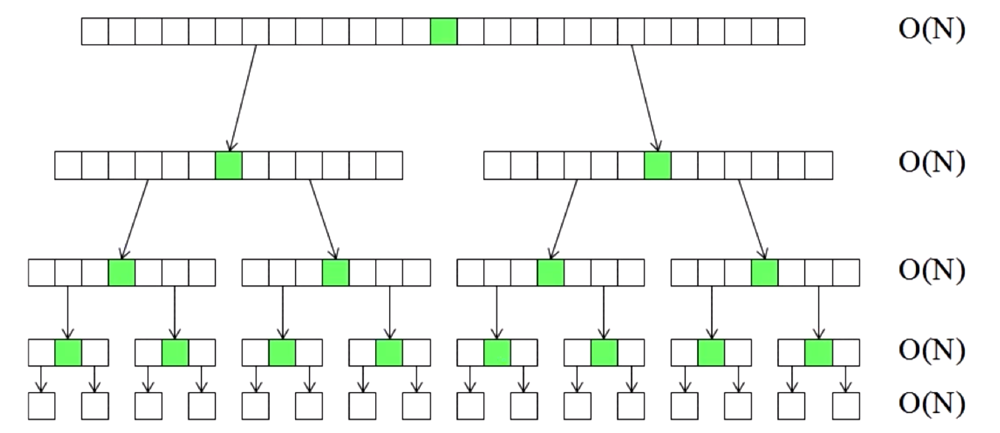
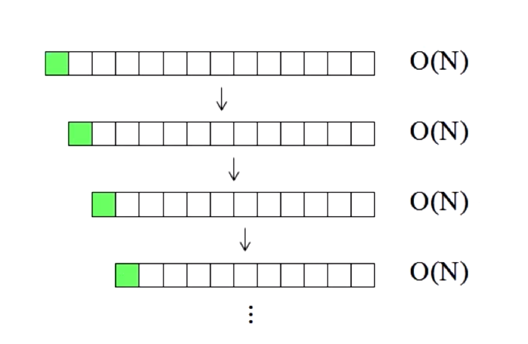
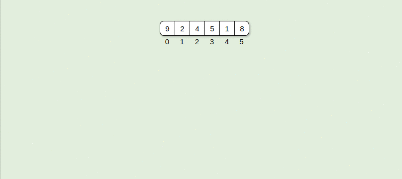
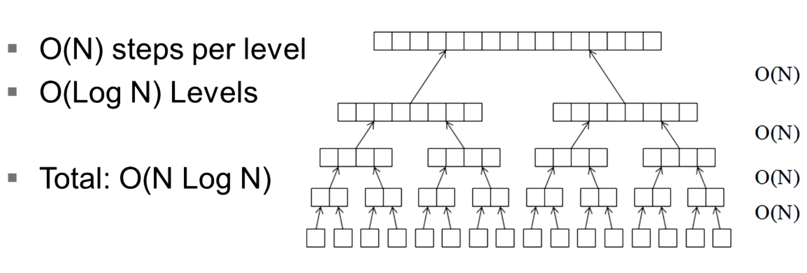
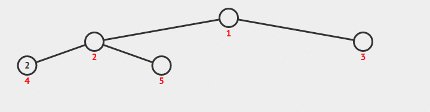
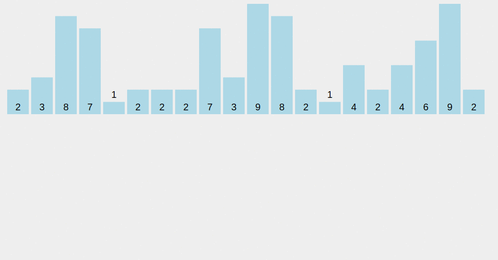
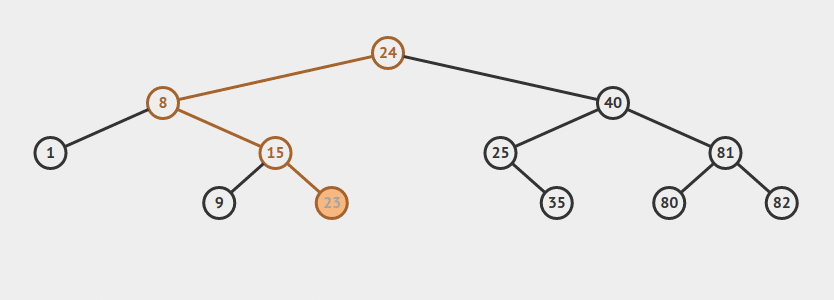
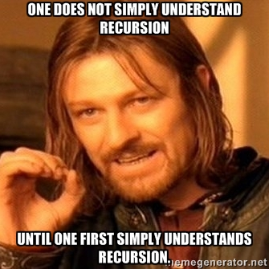
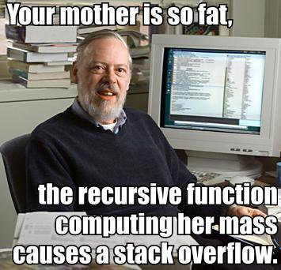

<table class="hide" width="100%" style='table-layout:fixed;'>
  <tr>
    <td>
      <a href="https://airtable.com/shr5KEX8NFdrG14j9?prefill_clase=07-Algoritmos-II">
      
      <br>
      Hacé click acá para dejar tu feedback sobre esta clase.
      </a>
    </td>
      <td>
      <a href="https://quiz.soyhenry.com/evaluation/new/607dd05356b4056ff0328371">
        
        <br>
        Hacé click acá completar el quizz teórico de esta lecture.
      </a>
  </td>
  </tr>
</table>

# Algoritmos II

## QuickSort

Ahora vamos a ver un algoritmo mucho más rápido, también es un poco más complejo. QuickSort está diseñado utilizando la Técnica __[Divide and Conquer](https://es.wikipedia.org/wiki/Algoritmo_divide_y_vencer%C3%A1s)__ que consiste en dividir un problema en subproblemas más pequeños, luego encontrar la solución de los problemas pequeños y combinarlas para encontrar la solución mayor.
Además _QuickSort_ es recursivo, o sea que se llama a sí mismo. Básicamente el algoritmo es así:

* Elegir un elemento de la lista de elementos a ordenar, al que llamaremos pivote.
* Mover los demás elementos de la lista a cada lado del pivote, de manera que a un lado queden todos los menores que él, y al otro los mayores. Los elementos iguales al pivote pueden ser colocados tanto a su derecha como a su izquierda, dependiendo de la implementación deseada. En este momento, el pivote ocupa exactamente el lugar que le corresponderá en la lista ordenada.
* La lista queda separada en dos sublistas, una formada por los elementos a la izquierda del pivote, y otra por los elementos a su derecha.
* Repetir este proceso de forma recursiva para cada sublista mientras éstas contengan más de un elemento. Una vez terminado este proceso todos los elementos estarán ordenados.


Como se puede suponer, la eficiencia del algoritmo depende de la posición en la que termine el pivote elegido.

En el mejor caso, el pivote termina en el centro de la lista, dividiéndola en dos sublistas de igual tamaño. En este caso, el orden de complejidad del algoritmo es `O(n·log n)`.



En el peor caso, el pivote termina en un extremo de la lista. El orden de complejidad del algoritmo es entonces de `O(n²)`.



El peor caso dependerá de la implementación del algoritmo, aunque habitualmente ocurre en listas que se encuentran ordenadas, o casi ordenadas. Pero principalmente depende del pivote, si por ejemplo el algoritmo implementado toma como pivote siempre el primer elemento del array, y el array que le pasamos está ordenado, siempre va a generar a su izquierda un array vacío, lo que es ineficiente.
En el caso promedio, el orden es `O(n·log n)`.

## MergeSort

Este algoritmo está inspirado en QuickSort, así que tambien es recursivo. Lo que hace es lo siguiente:

* Divide el conjunto en dos grupos iguales
* Ordena recursivamente los dos grupos
* Junta (o mergea) los grupos ordenados.



Ahora veamos su complejidad, que es similar al mejor caso de Quicksort. En cada nivel ( sabemos que hay `log(n)` niveles porque se divide en dos) se realizan `n` operaciones, una por cada elemento.



Por lo tanto el algoritmo tiene una complejidad de `O (N * log( N ))` en todos los casos, sin importar como esté ordenando al principio!
Lo malo de este algoritmo es que necesita más memoria que los demás algoritmos.

## Otros Algoritmos de ordenamiento

### Heapsort

Este algoritmo tambien tiene orden de `O(n·log n)` pero, contrario a Quicksort, este no depende fuertemente del estado inicial del ordenamiento. Este algoritmo está basado en la estrucura de datos conocida como `heap`, de ahi el nombre. :smile:

Primero analizemos qué complejidad tiene el armado del Heap. Cómo habiamos visto, cuando ingresamos un nuevo nodo, tenemos que ver si se siguen cumpliendo las dos reglas de un _heap_: que sea un arbol binario completo, y que cada nodo sea mayor que sus hijos. Básicamente lo que tenemos que controlar es que cuando ingresamos un nuevo nodo, si su valor sea menor que el padre, no hacemos nada. Si no, tenemos que cambiar ese nodo por el padre y controlar de nuevo, si es menor terminamos, o seguimos cambiando hasta llegar al nodo raíz. Habrá veces que cuando ingresas un valor nuevo, ese ya sea menor que el nodo padre, asi que no tenes que hacer nada, si siempre pasara lo mismo el costo de armar el heap sería `O(n)`. Ahora, el peor caso, es tener que llegar hasta la raíz haciendo swaps, sabemos que la altura de un árbol binario es del orden de `log(n)`, por lo tanto en el peor de los casos deberiamos recorrerlo `n` veces, por lo tanto la máxima complejidad es de `n*log( n )`.

Ahora veamos con __Heapsort__ utiliza esta estructura para ordenar. Como vemos el heap está _semi_ ordenado. Por lo pronto sabemos que el nodo ráiz, tiene el máximo valor. Sabiendo eso, lo que hace el algoritmo es sacar el nodo raíz (seria el primer elemento ordenado),  y pone el última nodo del heap en la raíz -esto seguramente rompe la regla de que los padres sean mayores que sus hijos-, y luego reacomoda el árbol para que vuelva a ser un heap. El algoritmo repite esto hasta que no queden nodos en el heap. El resultado es el arreglo ordenado!



Como tenemos que reordenar el árbol N veces, y habiamos dicho que ordenarlo costaba `O( log (n) )` entonces la complejidad este algoritmo es de `O(N * log(n) )`. Bastante bien, no?

### CountSort

Este algoritmo nos va a servir solamente para contar números enteros. Básicamente, lo que hace es iniciar un arreglo vacio y usarlo para contar los elementos. Para contar, va recorriendo el conjunto desordenado y suma en el arreglo en uno en la posición cuyo índice es igual al numero del conjunto.



Finalmente, mira el arreglo de contadores, y vas 'sacando' los elementos que contó. Como lo pusimos en un índice que ya viene ordenado, al sacarlos vamos a tener todos los elementos ordenados.
Nos damos cuenta que este algoritmo puede ocupar muchísima memoria, ya que si tenemos un conjunto con mucha variabilidad vamos a tener un arreglo muy grande y casi vació.

Con respecto a su complejidad, el algoritmo tiene que recorrer una vez el conjunto, o sea que en principio es `O( n )`. Luego tiene que armar de nuevo el conjunto ordenado, ahora no depende de la cantidad de elementos, si no del rango de los elementos que contenia el conjunto, que será el tamaño del arreglo donde ibamos contando, le llamemos M al rango. Ahora la complejidad es de orden `O( M )`. Por lo tanto la complejidad final es del orden de `O ( M + N )`, y podriamos simplificarla si supieramos cúal es de mayor orden. Esta complejidad es mejor que `O(N * log( N ))`. Así que si tenemos que ordenar enteros, este algoritmo nos puede servir.

### Radix Sort

Por último, vamos a mencionar al algoritmo Radix Sort. Este es muy parecido al Count Sort, en el sentido que sólo sirve para ordenar números enteros (en realidad, si logramos representar algo en números enteros, entonces podemos ordenar ese algo con Radix). Básicamente utiliza el mismo principio que Count, ya que mete en un arreglo fijo los números, pero ahora lo hace según las unidades de ese número, una vez ordenado repite el mismo proceso, pero con las decenas, y así sucesivamente hasta terminar con el arreglo ordenado. Veamos el ejemplo de abajo para comprender cómo funciona:


## Búsquedas

Otra tarea super importante que vamos a hacer siempre, es buscar un elemento entre una serie de elementos. Para eso vamos a utilizar algoritmos de búsqueda.

### Búsqueda Lineal

Esta solución es la más básica, o de fuerza bruta. Básicamente lo que hacemos es recorrer todo el conjunto, examinando cada uno hasta que encontramos el que queremos o hasta que recorramos todo el conjunto.
Como podrán darse cuenta, este algoritmo es de complejidad `O( N )`, porque en general vamos a tener que recorrer todo el arreglo hasta dar con nuestro objetivo. Este parecer ser una complejidad aceptable, ya que por los algoritmos que vimos antes, la mejor complejidad que lograbamos era cerca de `O(N * log( N ))`. De todos modos, este algoritmo sólo nos va a servir para buscar en conjuntos pequeños, ya que existen otros que son muchos más rápidos.

### Búsqueda Binaria

Cuando buscamos linealmente, en general, no tenemos ninguna pista sobre donde puede estar nuestro elemento objetivo dentro del conjunto. Por lo tanto no nos queda otra que recorrer todo el conjunto, esperando encontrarlo por algún lado. Pero que pasa si de antemano dejamos algunas pistas para que nuestro algoritmo encuentre lo que busca más rápido?
Por ejemplo, si tuvieramos que buscar un número en un arreglo, si ese arreglo estuviera ordenado, podriamos encontrarlo más rápido, no? (se acuerdan del juego de adivinar el número?) De hecho podriamos ir dividiendo el arreglo en mitades y preguntando si nuestro número está de un lado o del otro. Básicamente, estamos reduciendo el espacio de búsqueda a la mitad en cada paso. De esta forma, vamos a llegar a un espacio tan chico (un sólo elemento) donde encontrar el elemento que queríamos es trivial.
Como ya sabemos, al dividir en dos varias veces, vamos a tener `log(n)` niveles, como tenemos que buscar una vez en cada _hoja_ que queda, la complejidad de nuestro algoritmo va a ser de `O( log( n ) )`. Bastante mejor que el anterior, no? Y la complejidad agregada al algoritmo es muy poca. Lo único importante es mantener los datos ordenados!



### Depth/Breadth First Search

Si nos proponemos a recorrer todos los nodos de un árbol, vamos a notar que disintintas personas eligen un método distinto para hacerlo. De hecho, vamos a definir dos formas típicamente usadas para recorrer un árbol entero. Estos métodos pueden ser usados para hacer una búsqueda dentro de un árbol dado.

Consideremos el siguiente árbol:

```js
    A
   / \
  B   C
 /   / \
D   E   F
```

#### Depth First Search

Una búsqueda tipo DFS visitaría los nodos en el siguiente orden:
`A, B, D, C, E, F`. Gráficamente, vamos _bajando_ a través del árbol hasta llegar a una __hoja__. Luego seguidos por la siguiente rama y la recorremos del mismo modo.

#### Breadth First Search

La otra forma: BFS, visitaría los nodos de esta manera:
`A, B, C, D, E, F`. O sea, que recorriamos primero todos los nodos del nivel 1 del árbol, luego los del nivel 2, y así sucesivamente.

## Recursion

`Para entender la recursión primero tenemos que entender la recursión.`



Eso es la recursión, es cuando un un método se llama a sí mismo. Por ejemplo, el algoritmo quick sort es recursivo (se puede implementar de forma recursiva o no), ya que divide un conjunto y luego ordenada cada subconjunto usando quick Sort tambien.
La recursión puede ser muy poderosa, y puede ayudarnos a resolver algunos problemas que sin ella serían complicados de resolver. A veces puede no ser intuitiva, ya que estamos acostumbrados a pensar de manera iterativa más que recursiva.
Veamos un ejemplo: Habiamos visto la función factorial, básicamente el factorial de n o n! es `n! = 1 * 2 * 3 * 4 * ... * n`. ej: `4! = 1 * 2 * 3 * 4`.
Si lo definimos recursivamente, podemos decir que `n! = n * ( n-1 )!`. O sea, el factorial de n es igual a n por el factorial de n-1. Si lo piensan van a ver que se forma la misma fórmula que antes, pero hay un caso particular que es cuando `n = 0`, en ese caso tenemos que definir que hacemos. Por definición `0! = 1`, así que ese va a ser nuestro __caso base__: es el caso que devuelve algo concreto y donde se termina la recursión, su resultado va a ser usado para calcular los resultados de cada llamada.
O sea que para definir recursivamente la función factorial vamos a decir:

```js
0! = 1
n! = n * (n-1)!
```

Ahora está perfectamente definida.

Si ejecutamos eso tendriamos algo así:

```js
4! = 4 * 3!
   = 4 * 3 * 2!
   = 4 * 3 * 2 * 1!
   = 4 * 3 * 2 * 1 * 0!
   = 4 * 3 * 2 * 1 * 1  <-- acá terminó la ejecución
```

Esto que vemos arriba, es lo que se llama la __pila de recursión__, básicamente se va armando una pila en memoria, ya que la primera llamada necesita el resultado de la segunda, y la segunda de la tercera, y así sucesivamente hasta que llegamos al caso base. Desde ahí se puede empezar a resolver cada llamada dentro de la pila hasta que la completamos entera y tenemos nuestro resultado.



Por lo tanto tenemos que estar seguros que cuando llamamos a un función recursiva no llenemos el _runtime stack_, ya que al llenarse va a crashear el runtime con un error de __[Stack Overflow](http://stackoverflow.com)__, o _desbordamiento de pila_.

## Homework

Completa la tarea descrita en el archivo [README](https://github.com/soyHenry/FT-M1/blob/master/08-Algoritmos-II/homework/README.md)
