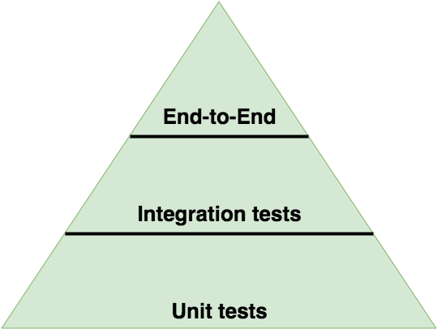
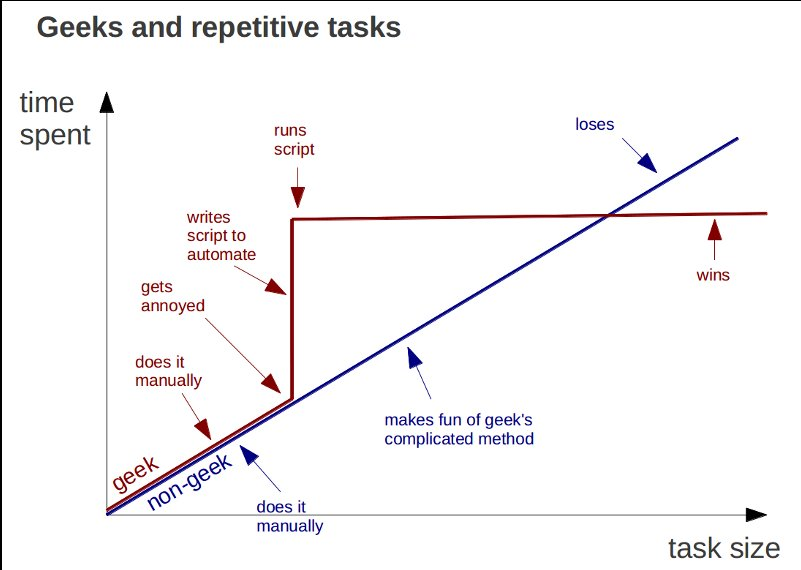
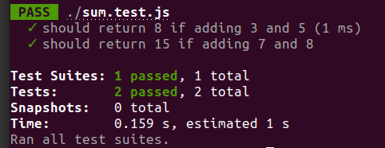
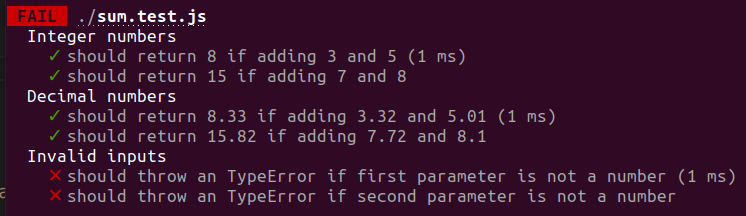
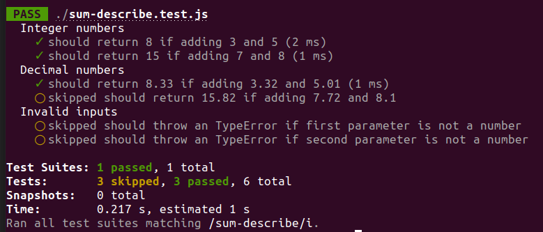
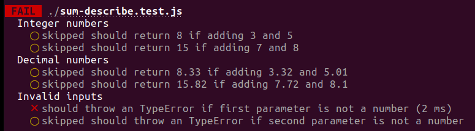
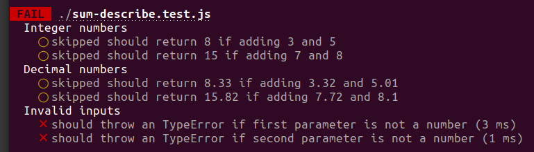

<table class="hide" width="100%" style='table-layout:fixed;'>
  <tr>
    <td>
      <a href="https://airtable.com/shr5KEX8NFdrG14j9?prefill_clase=EXTRA-Testing">
        
        <br>
        Hacé click acá para dejar tu feedback sobre esta clase.
      </a>
    </td>
  </tr>
</table>

# Software Testing

Cuando pensamos en testing en software, pensamos en algo que nos de garantías de que la aplicación que estamos construyendo funcione bien. Además de que funcionen bien en nuestra compu, nos vamos a asegurar que cuando lo deployemos (veremos esto más adelante), también funcionen en el destino o que si fallan algunos tests directamente no lleguen las nuevas actualizaciones al servidor de producción, por ejemplo.
Tambien podemos hacer del testing una _filosofía de vida_ cómo veremos más abajo, pero en general testear bien nuestra aplicación nos da más que sólo garantías, nos proveen una documentación viva de nuestro código.

## Qué cosas testear? Cuantos tests hacer?

Las respuestas a estas preguntas van a variar según el proyecto que estén haciendo y sus necesidades, pero en general pueden seguir las __guidelines__ seteadas en la siguiente _pirámide_:



En la pirámide vemos los tipos de pruebas y la cantidad de ellas que debemos hacer en nuestra aplicación. En general la mayoría de los tests que hagamos va a ser de tipo __unit tests__, en segundo lugar __Integration Tests__ y por último __End-to_End__. Veremos cada uno de estos tipos de tests en detalle.

## Unit Testing

Un test unitario o _unit test_ es un pedazo de código automático que invoca a una __unidad de trabajo__ del sistema y chequea que el resultado de esa unidad sea el esperado.
Una __unidad de trabajo__ es cualquier función lógica del sistema que no pueda ser separada en piezas más pequeñas y que puede ser invocada por alguna otra interfaz. Esta unidad puede ser sólo un método, o el comportamiento de una clase entera, o el comportamiento de varias clases interactuando entre ellas para lograr un próposito, que puede ser verificado.

La presencia de _tests unitarios_ habla de que el software fue construido (de alguna manera) de forma _modular_. Cuando escuches que alguien dice que _el software debería ser más __testeable___ se refiere a esto.

Un buen test unitario debería ser:

* Completamente automatizable
* Poder ejecutarse en cualquier orden en conjunto con otroso tests.
* __Siempre__ retorna el mismo resultado, no importa cuantas veces lo corra.
* Es rápido
* Testea un solo concepto lógico del sistema
* Es fácil de entender al leerlo
* Es fácil de mantener

> Si cuando estamos escribiendo los tests nos damos cuenta que tenemos que crear muchos [mockups](http://stackoverflow.com/questions/2665812/what-is-mocking), es una señal que nuestro diseño no es muy modular, y que tal vez se puede mejorar.

### Ventajas

Obviamente, armar todos los tests y correrlos (y pasarlos todos!) nos puede poner un overhead en nuestro proyecto.



Si el proyecto es chico, entonces podemos probar todo a mano y darnos cuenta rápido si un cambio afecta o no a las demás partes de la aplicación, pero a medida que el proyecto va a creciendo, se hace más complicado probar todo manualmente y más time-consuming. En esos casos hacer Units Tests automáticos nos va a brindar los siguientes beneficios:

* Nos va a permitir hacer cambios grandes en el código rápidamente. Cuando los hacemos, corremos los tests de nuevo y vemos rápidamente si todo funciona bien o no. Nos puede salvar varias horas de debugeo.
* Nos da un límite para decidir cuando una funcionalidad está terminada o no. Si pasa el test, entonces pasamos a la siguiente feature.
* Tenés feedback inmediato de tu código, podés ver examente donde está fallando y hasta usar eso para continuar trabajando donde dejaste la última vez.
* Si ya tenés experiencia armando tests, vas a poder codear más rápido, ya que tenés en la cabeza exactamente qué queres lograr antes de empezar a codear.
* Si tenés buenos tests definidos, estás muy cerca de tener una buena documentación, ya que en los tests implicitamente estás diciendo qué debería hacer cada cosa.
* Te va a ayudar a reutilizar tu código en otro proyecto. Cuando empezas un proyecto nuevo, llevá tu código y tus tests, refactorizá el código en el nuevo proyecto hasta que los tests pasen de nuevo! :smile:

## Integration Test

Estos tests prueban el funcionamiento de distintas unidades combinadas, por ejemplo la interacción entre un módulo y sus dependencias.

## End to End Tests

Estos tests sirven para probar la aplicación en su totalidad, es decir, usarla como si fueras el usuario final y probar si todo está funcionando bien. Por ejemplo, si estuvieramos trabajando en un eCommerce, probariamos si podemos loaguearnos, buscar un producto, agregarlo al carrito, y comprarlo!

## Test Driven Development

Test Driven Development (TDD) es una técnica para construir software que se basa en escribir tests. Básicamente consiste en el siguiente ciclo:


* __Agregá un test nuevo__: En TDD, para cada nueva feature vas a escribir un nuevo test, para hacerlo el desarrollador está obligado a conocer en detalle las especificaciones y requerimientos de esa feature. Esto es clave y es el gran diferenciador entre escribir el _test_ __después__ que hayas escrito el código, de esta forma tenés todo definido antes de empezar por la primera línea de código.
* __Corré todos los test y fijate si el nuevo falla__: Si ya teniamos otros tests, antes de empezar a codear nos fijamos si realmente el nuevo test NO pasa. En caso contrario estariamos implementando funcionalidad que ya está definida o funcionalidad que no sirve, o tal vez el test esté mal escrito.
* __Escribí el código__: Ahora sí, empezamos a escribir código de tal manera que logremos que el test pase. En esta etapa no importa la elegancia del código, sólo queremos pasar el test!
* __Corré los tests__: Si todos los test corren, incluido el nuevo, el desarrollador está seguro que el nuevo código cumple con los requerimientos de la funcionalidad y además que los nuevos cambios no rompen ninguna otra feature ya existente. Si no pasan, hay que volver al punto 4!
* __Refactoreá el código__: Una vez que hayamos pasado el test, vamos a refactorear el código para que sean lo más legibles y performantes posibles, y que mantengan la convención de nombres y patrones que todo el proyecto.
* __Repetí__: Ahora pasamos a un nuevo test, es decir vamos a agregar un nuevo feature o funcionalidad y vamos a empezar desde el primer paso!

Como siempre, existen variaciones sobre este _standart_, de hecho hay dos grandes concepciones, la de codear primero y escribir los test despues, o al reves. Si escribimos los  _units tests_ primero y una vez que terminamos empezamos a codear el nuevo feature  nos aseguramos que entendemos bien el problema antes de empezar a codear la solución.

## Testing Frameworks

Existen muchas herramientas que nos van a ayudar a automatizar la creación, ejecución y control de los tests unitarios. De hecho, exiten herramientas que sirven como 'ambientes' de prueba, y con ellas vamos a poder armar el workflow de tests (agrupar tests, ejecutar los tests automáticamente antes de hacer un deployment, etc..) y tambien existen librerías de _Aserción_ (assertion), que nos van a servir para comprobar si el output esperado de una función condice con el output real.

> En programación una _aserción_ o _assertion_ es un predicado (expresión que devuelve verdadero o falso), incluido en un programa y que generalmente compara el resultado o el estado esperado de algo contra el real en el momento de ejecución.

Hay muchos tipos de frameworks de pruebas y también librerías de assertion, nosotros vamos a usar `Jest`.

## [JEST](https://jestjs.io/)

JEST es un framework de testing de fácil uso pero a la vez con muchisimas posibilidades. Viene con una librería de assertion integrada por lo que no tendremos que configurar ninguna.

### Configuración

Para comenzar a utilizar JEST basta con:

* Instalar la dependencia: `npm install --save-dev jest`
* Ejecutar `jest` o sino agregar script al package.json:

  ```js
  "scripts": {
    "test": "jest"
  }
  ```

Luego ejecutamos `npm test` y ya estaríamos corriendo los tests, como inicialmente no vamos a tener ninguno por consola nos dirá que no ha encontrado tests. En breve explicaremos como armar nuestro primer archivo de test pero antes, el comando jest admite muchas opciones o flags entre los cuales vamos a mencionar los siguientes:

* Correr solo los archivos de tests que matcheen con determinado patron dentro de su nombre: `jest test-pattern`
* Correr un determinado archivo de test mediante su path: `jest path/to/test.js`
* Correr solo UN test mediante su nombre (Ya veremos como definir nombre para los tests): `jest -t name-spec`
* Correr en modo 'watcher': `jest --watch` o `jest --watchAll` (El primero solo correra los tests que fueron afectados por alguna modificación desde la última vez que hicimos cambio en el código)
* Agregar un resumen de cada archivo de test: `jest --verbose` (En el caso de ser un único archivo automáticamente lo hace sin necesidad del flag)

### Ejemplo (Está dentro de la carpeta demo)

Estos archivos ya se encuentran creados dentro de la carpeta demo pero si quieren hacerlo de cero en otro lado para practicar pueden hacerlo.

Crearemos un archivo `sum.js` y dentro de él una función `sum` que la exportaremos para poder utilizarla luego en el archivo de tests:

```js
function sum(a, b) {
  return a + b;
}

module.exports = sum;
```

Luego crearemos otro archivo, `sum.test.js` donde definiremos los tests que luego ejecutará JEST:

```js
const sum = require('./sum');

// it === test
it('should return 8 if adding 3 and 5', () => {
  expect(sum(3, 5)).toBe(8);
});

it('should return 15 if adding 7 and 8', () => {
  expect(sum(7, 8)).toBe(15);
});
```

Si ahora ejecutamos `npm test` (Configurar previamente el package.json como mostramos antes) debería ejecutarse los tests.



Si analizamos la estructura del ejemplo anterior usamos algunas palabras que hasta hoy no conociamos, como por ejemplo `it`, `expect` y `toBe`.

Entendamos para que sirve cada uno de ellas:

* `it` o `test`: nos permiten definir un nuevo test
* `expect`: función de JEST que va a devolver un "expectatio" object sobre el cual luego podremos invocar algunos `matchers`. Explicado más sencillo es lo que estamos ejecutando para probar, por ejemplo `sum(3,5)` arriba estariamos probando la función que creamos pasandole esos dos parámetros y sobre la respuesta vemos si se cumple la condición que queremos o no.
* `toBe`: es un matcher propio de JEST (no es el único de hecho ahora vamos a ver otros) que nos permite hacer una comparación exacta, en este ejemplo entre lo que devolvió la funcion `sum(3,5)` y el valor numérico 8. Si coinciden el test va a pasar y sino no.

### Matchers

JEST tiene distintos matchers para realizar distintas validaciones sobre las funcionalidades que queremos probar:

* `toBe`: igualdad exacta
* `toEqual`: verificación recursiva de cada propiedad del objeto o elemento del arreglo
* `toBeNull`: verifica que el valor sea null
* `toBeUndefined`: verifica que el valor sea undefined
* `toBeDefined`: verifica que el valor sea distinto de undefined
* `toBeTruthy`: verifica que el valor de veracidad sea verdadero sin necesariamente ser literalmente `true`
* `toBeFalse`: verifica que el valor de veracidad sea falso sin necesariamente ser literalmente `false`
* `toBeGreaterThan`: verifica que el valor sea mayor al de referencia
* `toBeGreaterThanOrEqual`: verifica que el valor sea mayor o igual al de referencia
* `toBeLessThan`: verifica que el valor sea menor al de referencia
* `toBeLessThanOrEqual`: verifica que el valor sea menor o igual al de referencia
* `toBeCloseTo`: verifica que el número este a pocos decimales de diferencia del valor de referencia
* `toMatch`: compara contra una expresión regular
* `toContain`: verifica si dentro de un arreglo existe determinado elemento
* `toThrow`: verifica si la función arroja un error

No son los únicos, existen más que pueden consultar en la [documentación oficial de JEST](https://jestjs.io/docs/expect).
Adicionalmente algunos de estos matchers mencionados arriba se encuentran en la demo `matchers.test.js` para que puedan ver como utilizarlos con ejemplos.

### Running Options

#### describe

Podemos también agrupar tests en "categorías" utilizando la palabra `describe`, por ejemplo siguiendo el ejemplo anterior de la suma podríamos tener casos con numeros enteros, otros con números decimales y otro con inputs inválidos:



Es posible armar también subcategorias poniendo describes dentro de otros describes.

#### Skip Tests

En el caso de que algunos tests no queramos que se ejecuten podemos saltearlos de forma individual colocando `xit` en vez de `it` cuando son definidos en el archivo de tests o sino podemos incluso saltear todo un `describe` completo colocando `xdescribe`.

Por ejemplo en el archivo `sum-describe.test.js` de la carpeta demo podríamos modificar alguns tests para que no se ejecuten:

```js
describe('Decimal numbers', () => {
  it('should return 8.33 if adding 3.32 and 5.01', () => {
    expect(sum(3.32, 5.01)).toBe(8.33);
  });
  
  xit('should return 15.82 if adding 7.72 and 8.1', () => {
    expect(sum(7.72, 8.1)).toBe(15.82);
  });
});

xdescribe('Invalid inputs', () => {
  it('should throw an TypeError if first parameter is not a number', () => {
    expect(() => sum('Franco', 5)).toThrow(TypeError);
  });
  
  it('should throw an TypeError if second parameter is not a number', () => {
    expect(() => sum(3, true)).toThrow(TypeError);
  });
});
```

Si observamos ahora la ejecución del comando `npm test sum-describe` veremos que el segundo test del describe de 'Decimal numbers' y todo el describe de 'Invalid inputs' no se van a ejecutar:



#### only

Hay casos en los que solamente queremos probar un tests para evitar que la consola se nos llene de código que no nos estaría interesando en ese momento, para esto JEST tien también una opcion `only` para ejecutar únicamente un test de toda la suite de tests. Volviendo al ejemplo anterior, si solo quisieramos ejecutar el test `should throw an TypeError if first parameter is not a number` podríamos colocarle `it.only` (Para probarlos en la demo saquen los `xit` y `xdescribe`).

```js
...

describe('Invalid inputs', () => {
  it.only('should throw an TypeError if first parameter is not a number', () => {
    expect(() => sum('Franco', 5)).toThrow(TypeError);
  });
  
  it('should throw an TypeError if second parameter is not a number', () => {
    expect(() => sum(3, true)).toThrow(TypeError);
  });
});
```

Ahora al ejecutar `npm test sum-describe` veremos que todo el resto de los tests fueron salteados:



Lo mismo se puede aplicar sobre los `describe` para ejecutar únicamente un grupo de tests.

```js
...

describe.only('Invalid inputs', () => {
  it('should throw an TypeError if first parameter is not a number', () => {
    expect(() => sum('Franco', 5)).toThrow(TypeError);
  });
  
  it('should throw an TypeError if second parameter is not a number', () => {
    expect(() => sum(3, true)).toThrow(TypeError);
  });
});
```



## Homework

Completa la tarea descrita en el archivo [README](https://github.com/soyHenry/FT-M1/blob/master/EXTRA-Testing/homework/README.md)
