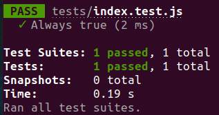
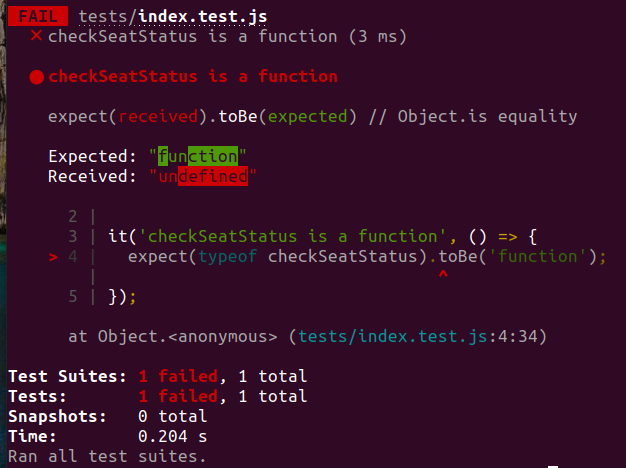
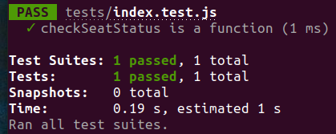
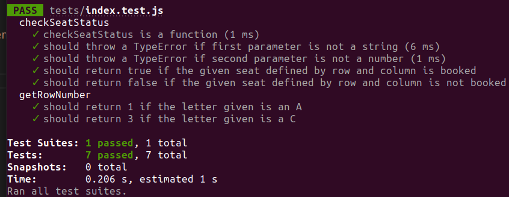
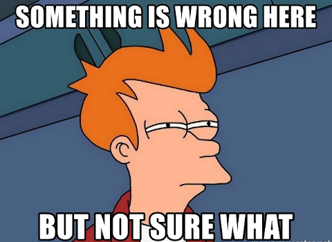

# Testing Homework

## Introducción

La idea de esta homework será realizar TDD para el desarrollo de una aplicación en JS utilizando JEST. A continuación se irán detallando paso a paso las funcionalidades que deberá tener el programa y ustedes tendrán que ir haciendo para caso paso:

1. Armar el asociado a esa funcionalidad
2. Ejecutarlo chequeando que no pasen
3. Completar el código JS para hacer pasar el test
4. Ejecutar y verificar que pase el test sin haber roto ningún test anterior, sino volver a 3 arreglando los errores
5. Avanzar a la siguiente funcionalidad

## Configuración

JEST ya se encuentra dentro de las dependencias en el `package.json` por lo que simplemente con ejectuar `npm install` es suficiente. Por otro lado también se agregó el script `test` que va a permitir correr todos los tests dentro de la carpeta `homework`.

Inicialmente si ejecutan el comando `npm test` no va a funcionar correctamente ya que no existe ningún test dentro del archivo `index.text.js` de la carpeta `tests`. Pueden realizar una prueba incial poniendo un test simple:

```js
it('Always true', () => {
   expect(true).toBe(true);
});
```

<p align="center">
  
</p>

## Instrucciones

Ahora si pueden borrar el test de ejemplo de recién y vamos a comenzar a armar los verdaderos tests usando TDD.

---

### TEST ONE

Comprobar que existe una función llamada `checkSeatStatus`. Les dejamos comentado la linea del require que nos va a permitir utilizar la función definida en el archivo `homework.js` dentro de `index.test.js`, descomentarla.

**PISTA**: Deberán chequear que esa variable sea de tipo 'function' (¿Cómo era esto? Estoy seguro que lo vimos en el Prep)

<details>
  <summary>ANSWER TEST CODE</summary>
  
  ```js
  const { checkSeatStatus } = require('../homework');

it('checkSeatStatus is a function', () => { expect(typeof checkSeatStatus).toBe('function'); });

````
</details>

<p align="center">

</p>

___

### CODE ONE

Ahora escribamos el código para que ese test que acabamos de crear y no está pasando si pase. Para ello tendrás que crear la función `checkSeatStatus` en el archivo `homeowrk.js`. Les dejamos comentado unas lineas al final del archivo para exportar la función para que pueda ser utilizada en otros archivos, descomentarla.

<details>
<summary>ANSWER CODE</summary>

```js
function checkSeatStatus() {

}

module.exports = {
  checkSeatStatus
}
````

</details>

<p align="center">
  
</p>

---

### TEST TWO

La función `checkSeatStatus` debe recibir como primer parámetro un string, de lo contrario debería arrojar un error del tipo `TypeError` con el texto `First parameter is not a string`.

<details>
  <summary>ANSWER TEST CODE</summary>
  
  ```js
  it('should throw a TypeError if first parameter is not a string', () => {
    expect(() => checkSeatStatus(4)).toThrow(new TypeError('First parameter is not a string'));
  });
  ```
</details>

---

### CODE TWO

Cuando hacemos TDD buscamos realizar el código mínimo necesario para que los tests pasen, por lo que si los tests no están bien diseñados podrían llevar a un código incorrecto como podría ocurrir en este caso. Nuestra función debe arrojar un `TypeError` si no recibe un string como primer parámetro, pero podríamos simplemente en todos los casos arrojar dicho error y pasaría el test ¿verdad? Por ahora dejemoslo así y más adelante lo corregiremos.

<details>
  <summary>ANSWER CODE</summary>
  
  ```js
  it('should throw a TypeError if first parameter is not a string', () => {
    expect(() => checkSeatStatus(4)).toThrow(new TypeError('First parameter is not a string'));
  });
  ```
</details>

---

### TEST THREE

Ahora queremos que el segundo parámetro de la función sea un número, de lo contrario debería arrojar un error del tipo `TypeError` con el texto `Second parameter is not a number`.

<details>
  <summary>ANSWER TEST CODE</summary>
  
  ```js
  it('should throw a TypeError if second parameter is not a number', () => {
    expect(() => checkSeatStatus('A', '2')).toThrow(new TypeError('Second parameter is not a number'));
  });
  ```
</details>

---

### CODE THREE

Si miramos nuestro código anterior nos daremos cuenta de que no estaba tan bien como creíamos ya que ahora que necesitamos dar una respuesta condicional basada en si el error está en el primer o segundo parámetro debemos modificar dicho código. Es más... fijense que si le pasabamos un string como primer parámetro igualmente iba a arrojar un error. ¿Cómo lo arreglamos?

<details>
  <summary>ANSWER CODE</summary>
  
  ```js
  function checkSeatStatus(row, number) {
    if(typeof row !== 'string') throw new TypeError('First parameter is not a string');
    if(typeof number !== 'number') throw new TypeError('Second parameter is not a number');
  }
  ```
</details>

---

### TEST FOUR

Para continuar con el ejercicio, vamos a mockear información simulando el layout de asientos de un cine utilizando una matriz de la siguiente forma:

```js
const layout = [
   [
      { type: 'VIP', booked: false },
      { type: 'VIP', booked: true },
      { type: 'VIP', booked: true },
      { type: 'VIP', booked: false },
   ],
   [
      { type: 'NORMAL', booked: false },
      { type: 'VIP', booked: true },
      { type: 'VIP', booked: false },
      { type: 'NORMAL', booked: false },
   ],
   [
      { type: 'NORMAL', booked: false },
      { type: 'NORMAL', booked: true },
      { type: 'NORMAL', booked: true },
      { type: 'NORMAL', booked: false },
   ],
   [
      { type: 'ECONOMIC', booked: true },
      { type: 'NORMAL', booked: true },
      { type: 'NORMAL', booked: true },
      { type: 'ECONOMIC', booked: false },
   ],
   [
      { type: 'ECONOMIC', booked: false },
      { type: 'ECONOMIC', booked: true },
      { type: 'ECONOMIC', booked: false },
      { type: 'ECONOMIC', booked: false },
   ],
];
```

Copienlo en el archivo `homework.js` para poder utilizarlo dentro de la función `checkSeatStatus`. Pero antes vamos a armar otra función ahora en el archivo `homework.js` llamada `getRowNumber` que nos va a permitir a partir de una letra devolver el número de fila asociado. Por ejemplo la fila 'A' sería la posición 0, la fila 'C' sería la 2.

**IMPORTANTE**: Vamos a tener que exportar la nueva función en el archivo `homework.js` y por otro lado requerirla en `index.test.js`

```js
// homework.js
function getRowNumber(letter) {

}

...

module.exports = {
  checkSeatStatus,
  getRowNumber
}
```

```js
// index.test.js
const { checkSeatStatus, getRowNumber } = require('../homework');
```

Creemos el test para esta función probemos con las dos letras de ejemplo que dimos arriba 'A' y 'C'.

<details>
  <summary>ANSWER TEST CODE</summary>
  
  ```js
  it('should return 1 if the letter given is an A', () => {
    expect(getRowNumber('A')).toBe(0);
  });

it('should return 3 if the letter given is a C', () => { expect(getRowNumber('C')).toBe(2); });

````
</details>

___

### CODE FOUR

¿Y cómo paso de una letra a un número de fila?

<p align="center">

</p>

<details>
<summary>¡AUXILIO! PEDIR PISTA</summary>

```js
// Podemos usar el código de las letras mayúsculas
// Sabemos que .charCodeAt(0) aplicado al argumento row nos daria el código asociado
// a dicha letra de fila y que la 'A' tiene código 65, la 'B' 66 y así sucesivamente...
// Por lo tanto podríamos hacer algo así:
row.charCodeAt(0) - 65;
// De esta forma:
//    'A' --> 0
//    'B' --> 1
//     ...
````

</details>

<details>
  <summary>ANSWER CODE</summary>
  
  ```js
  function getRowNumber(letter) {
    return letter.charCodeAt(0) - 65;
  }
  ```
</details>

---

### TEST FIVE

Lo que vamos a hacer ahora es crear un test que, a partir de una letra que va a representar el número de fila y un número que va a ser la columna, deberá indicar si el asiento está libre o no (true o false). Mirando la data de arriba sabemos que por ejemplo en la fila 'A' la segunda columna está reservada pero la cuarta columna de la última fila no, podríamos crear dos tests uno para cada uno de estos casos. Ojo, recuerden que la cuarta columna en cuanto a índices de array sería el número 3 por ejemplo.

<details>
  <summary>ANSWER TEST CODE</summary>
  
  ```js
  it('should return true if the given seat defined by row and column is booked', () => {
    expect(checkSeatStatus('A', 1)).toBe(true);
  });

it('should return false if the given seat defined by row and column is not booked', () => { expect(checkSeatStatus('E', 3)).toBe(false); });

````
</details>

___

### CODE FIVE

Vamos a reutilizar la función `getRowNumber` dentro de `getSeatStatus` para saber hasta que posición de la matriz debemos iterar. Y luego accederemos a la columna a partir del número que nos pasen por parámetro y cuando estemos en el asiento indicado debremos ver si su propiedad `booked` es `true` o `false`.

<details>
<summary>ANSWER CODE</summary>

```js
function checkSeatStatus(row, number) {
  if(typeof row !== 'string') throw new TypeError('First parameter is not a string');
  if(typeof number !== 'number') throw new TypeError('Second parameter is not a number');

  const numberRow = getRowNumber(row);
  const layoutRows = layout[numberRow];
  const seat = layoutRows[number];
  return seat.booked;
}
````

</details>

<p align="center">
  
</p>

---

### REFACTOR

Podemos intentar agrupar los tests según algun criterio, por ejemplo, podría ser dependendido de la función que esten testeando, ya sea `getRowNumber` o `getSeatStatus`. Para ello tendrán que utilizar el `describe`.

<details>
  <summary>ANSWER CODE</summary>
  
  ```js
  describe('checkSeatStatus', () => {
    ...
  });

describe('getRowNumber', () => { ... });

````
</details>

<p align="center">

</p>

Sigamos...

<p align="center">

</p>

___

### TEST SIX

Sigamos ahora con una función para simular la compra de uno de los asientos, vamos a tener que especificarle al igual que en `checkSeatStatus` la letra de la fila y el número de columna y deberíamos testear dos posibles casos:
- Si el asiento está libre debería reservarlo y retornar 'Seat in XX successfully booked'
- Si el asiento está reservado debería dejarlo como estaba y retornar 'Seat in XX is already booked'
Donde XX es la posición del asiento representada por fila y columna como veníamos hablando.
Mantengamos el orden de los describe y agrupemos estos dos nuevos tests en otro describe.

Llamaremos a la función `book` por lo que como ya hicimos con las funciones anteriores tendremos que agregarla en el `homework..js`, exportarla y requerirla desde `index.test.js`. Por ahora no hagamos la funcionalidad solo el 'esqueleto' para seguir haciendo TDD. ¿Cómo quedarían estos dos tests?

<details>
<summary>ANSWER TEST CODE</summary>

```js
describe('book', () => {
  it('should return "Seat in XX successfully booked" if the given seat is not booked', () => {
    expect(book('E',3)).toBe('Seat in E3 successfully booked');
  });

  it('should return "Seat in XX is already booked" if the given seat is already booked', () => {
    expect(book('A',1)).toBe('Seat in A1 is already booked');
  });
});
````

</details>

---

### CODE SIX

Vayamos ahora a codear la función `book`. Recuerden evitar duplicar código reutilizando otras funciones de ser posible guiño guiño.

<details>
  <summary>ANSWER CODE</summary>
  
  ```js
  function book(row, number) {
    if(checkSeatStatus(row,number)) return `Seat in ${row}${number} is already booked`;
    const numberRow = getRowNumber(row);
    const layoutRows = layout[numberRow];
    const seat = layoutRows[number];
    seat.booked = true;
    return `Seat in ${row}${number} successfully booked`
  }
  ```
</details>

<p align="center">
  
</p>

¿Puede detectar algunos errores ya sea en el testing o el código de esta funcionalidad?

¿Qué pasaría si simplemente si no entra al primer `if` devolvieramos `Seat in ${row}${number} successfully booked`? Pruebenlo y van a ver que los tests seguirían pasando, pero no estaríamos cambiando el estado del asiento a reservado. Esto nos demuestra que nuestra test no está del todo correcto, falta verificar una parte de la funcionalidad...

Vamos a modificar un poco el test `should return "Seat in XX successfully booked" if the given seat is not booked`. ¿Que deberíamos agregar?

<details>
  <summary>ANSWER TEST CODE</summary>
  
  ```js
  it('should return "Seat in XX successfully booked" if the given seat is not booked', () => {
    expect(checkSeatStatus('E',3)).toBe(false);
    expect(book('E',3)).toBe('Seat in E3 successfully booked');
    expect(checkSeatStatus('E',3)).toBe(true);
  });
  ```
</details>

Adicionalmente si prestamos atención a las funciones `checkSeatStatus` y `book` hay varias lineas de código repetidas entre ambas funciones, por lo que podríamos hacer un refactor y crear una nueva función que se encargue de esa parte de la lógica, la llamaremos `getSeat`.

<details>
  <summary>ANSWER CODE</summary>
  
  ```js
  function getSeat(letter, number) {
    const numberRow = getRowNumber(letter);
    const layoutRows = layout[numberRow];
    const seat = layoutRows[number];
    return seat;
  }

function checkSeatStatus(row, number) { if(typeof row !== 'string') throw new TypeError('First parameter is not a string'); if(typeof number !== 'number') throw new TypeError('Second parameter is not a number');

    const seat = getSeat(row, number);
    return seat.booked;

}

function book(row, number) { if(checkSeatStatus(row,number)) return `Seat in ${row}${number} is already booked`; const seat = getSeat(row, number); seat.booked = true; return `Seat in ${row}${number} successfully booked` }

```
</details>

Fijense que no cambiamos nada de funcionalidad, sino que solamente reorganizamos nuestro código, de hecho si corremos los tests van a seguir funcionando todos.

___

### MÁS TESTS...

Para los próximos pasos ya no tendrán ayudas de código, simplemente les diremos que funcionalidades deben agregar siguiendo TDD como veníamos haciendo.

<p align="center">

</p>

Funcionalidades a agregar:

- Verificar que la fila de asientos que nos pasan sea una letra y no una palabra o un string vacio y sino arrojar un error apropiado
- Verificar que la letra de la fila no este asociada a un número que supere la cantidad de filas del layout y sino devolver un mensaje que indique el rango de letras aceptadas
- Verificar que la columna no supere la cantidad de columnas para esa fila y sino devolver un mensaje que indique el rango de números aceptados para esa fila
- Obtener un resumen del layout en determinado momento, indicando cantidad de asientos totales, cantidad de asientos reservados, cantidad de asientos libres y recaudación suponiendo que cada asiento `ECONOMIC` cuesta 300 pesos, los `NORMAL` 450 pesos y los `VIP` 600 pesos.

</br >

---

## **✅ FEEDBACK**

### Usa este [**formulario**](https://docs.google.com/forms/d/e/1FAIpQLSe1MybH_Y-xcp1RP0jKPLndLdJYg8cwyHkSb9MwSrEjoxyzWg/viewform) para reportar tus observaciones de mejora o errores. Tu feedback es muy importante para seguir mejorando el modelo educativo.
```
